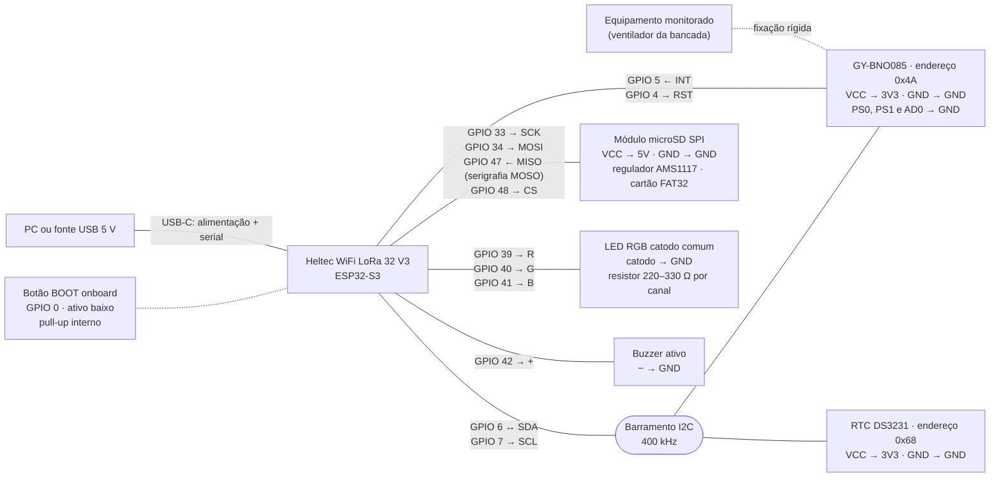

<p align="center">
  
</p>

# Entregável 06: documentação técnica do PulsoPNAAT

## 1. Visão geral

Motores e ventiladores mudam o padrão de vibração bem antes de quebrar, mas ninguém percebe essa
mudança a olho nu. Sem monitoramento, a manutenção só acontece depois da parada, com custo de
emergência e produção perdida. O PulsoPNAAT é um nó de borda (ESP32-S3 Heltec WiFi LoRa 32 V3 com
acelerômetro GY-BNO085) preso na carcaça do equipamento. Ele mede a vibração nos três eixos a
400 Hz e, a cada segundo, calcula 18 métricas (RMS, harmônicas 1x e 2x, banda 3x–5x, kurtosis e
THD por eixo). Um modelo treinado com dados reais do próprio equipamento reconhece em que condição
ele está (parado, velocidade 1, 2 ou 3, ou com falha de alimentação) e se a vibração é a esperada
para essa condição. O resultado aparece no LED RGB e no buzzer, vai por MQTT para um dashboard no
Grafana e fica gravado em CSV no microSD, com a hora do RTC DS3231. O nó só observa e avisa, nunca
desliga o equipamento.

## 2. Arquitetura

### 2.1 Fluxo Entrada → Processamento → Saída

**Entrada**

- Vibração: o GY-BNO085, preso na carcaça, entrega aceleração linear em m/s² (já sem a gravidade)
  a 400 Hz pelo I2C (GPIO 6/7), com aviso de dado pronto no GPIO 5.
- Comandos: botão BOOT da placa (GPIO 0), console serial ou mensagem no tópico
  `pulsopnaat/command`. Comandos aceitos: `calibrar`, `status` e os rótulos `parado`, `vel1`,
  `vel2`, `vel3`, `saudavel`, `falha` e `sem_rotulo`.
- Hora: com Wi-Fi, o nó sincroniza com `pool.ntp.org` e acerta o RTC DS3231, que guarda a hora
  sem rede.

**Processamento** (ESP32-S3 com FreeRTOS)

1. Amostragem (core 0): janelas de 1 s com 400 amostras por eixo. Leituras impossíveis (acima de
   20 g) são descartadas, e o sensor é reiniciado sozinho se ficar 2 s sem mandar amostra.
2. Métricas (core 1): filtro Hampel e FFT de 512 pontos com janela de Hann, cerca de 11 ms por
   janela.
3. Condição e saúde: o modelo compara as 18 métricas com a assinatura de cada condição aprendida
   no treino (distância de Mahalanobis) e escolhe a mais próxima. Se a condição reconhecida for a
   falha de alimentação, o estado é crítico. Nas outras, a distância até a assinatura decide:
   normal, atenção ou crítico. A velocidade exibida só troca quando 7 das últimas 9 janelas
   concordam, e o estado só muda depois de 3 janelas seguidas iguais.
4. Máquina de estados: `BOOT → CALIBRANDO → MONITORANDO ⇄ CONTINGÊNCIA`. Os limiares estatísticos
   da calibração (média + 3σ e média + 6σ) continuam sendo calculados e publicados, só para
   comparação com o modelo.

**Saída**

- Local: LED RGB (GPIO 39/40/41) e buzzer (GPIO 42).
- Remota: por MQTT, `pulsopnaat/telemetria` recebe uma mensagem por segundo (métricas, condição
  reconhecida, estado e a opinião dos limiares antigos), `pulsopnaat/alert` recebe cada alerta
  confirmado e `pulsopnaat/status` recebe o status do nó. Telegraf grava no InfluxDB, e o Grafana
  mostra o dashboard, localmente ou por um link público.
- Registro: CSV no microSD (`/sdcard/pulso/log_AAAAMMDD_HHMMSS.csv`), uma linha por segundo com
  hora UTC e um arquivo novo a cada 15 min. A gravação roda numa tarefa separada e não atrasa a
  amostragem.

### 2.2 Esquema elétrico

Todos os módulos usam o GND da placa. O BNO085 e o DS3231 dividem o mesmo barramento I2C.



Pinagem tirada de `main/Kconfig.projbuild`, `components/alert_manager/Kconfig` e
`components/storage/Kconfig`. Ilustrações em [docs/img/pulsopnaat_pinout.svg](docs/img/pulsopnaat_pinout.svg)
e [docs/img/PulsoPNAAT_protoboard.svg](docs/img/PulsoPNAAT_protoboard.svg).

## 3. Pré-requisitos

### 3.1 Hardware

| Item | Uso | Observação |
|---|---|---|
| Heltec WiFi LoRa 32 V3 (ESP32-S3) | Processamento, Wi-Fi, LED e buzzer | Cabo USB-C de dados (cabo só de carga não grava) |
| Módulo GY-BNO085 | Acelerômetro de 3 eixos | Modo I2C: PS0 e PS1 no GND |
| RTC DS3231 | Hora dos registros | Mesmo barramento I2C do BNO085 |
| Módulo microSD SPI com regulador + cartão | Registro em CSV | Cartão em FAT32. Funcionou com 16 GB; um de 128 GB em exFAT não montou |
| LED RGB catodo comum + 3 resistores de 220–330 Ω | Sinalização | Anodo comum também serve, trocando a polaridade no `menuconfig` |
| Buzzer ativo | Alarme de estado crítico | Liga e desliga por nível lógico |
| Protoboard e jumpers curtos | Montagem | Fios do I2C curtos e longe do cabo de força do motor |
| Ventilador de 3 velocidades | Equipamento da bancada | Sensor preso firme na carcaça |
| Filtro de linha com mau contato | Falha de alimentação da demonstração | Opcional, só para reproduzir a falha |

### 3.2 Software

| Software | Versão usada | Uso |
|---|---|---|
| ESP-IDF | 5.5.5 (Windows, instalador EIM) | Compilar, gravar e monitorar o firmware |
| Driver CP210x (Silicon Labs) | — | A placa aparece como porta COM (ex.: `COM4`) ou `/dev/ttyUSB0` |
| Git | — | Clonar o repositório |
| Docker Engine + Compose v2 | Docker 29.1.3, Compose 2.40.3 | Stack MQTT → Telegraf → InfluxDB → Grafana |
| WSL2 + Ubuntu 22.04 | — | Só no Windows sem Docker Desktop |
| Python 3 + `numpy` | Python 3.11, numpy 2.4 | Treinar o modelo com o dataset |

Rede: Wi-Fi de 2,4 GHz com internet. O ESP32-S3 não conecta em 5 GHz. O nó usa a internet para o
broker MQTT público e o NTP; o PC, para baixar as imagens Docker e publicar o link do Grafana.

## 4. Instalação e dependências

### 4.1 Repositório

```bash
git clone https://github.com/jhonatan-goncalves-pereira/pulsopnaat.git
cd pulsopnaat
```

### 4.2 ESP-IDF 5.5.5

Instale pelo guia oficial do ESP32-S3:
<https://docs.espressif.com/projects/esp-idf/en/stable/esp32s3/get-started/>. Em cada terminal
novo, ative o ambiente:

```powershell
# Windows (caminho padrão do instalador EIM)
. 'C:\Espressif\tools\Microsoft.v5.5.5.PowerShell_profile.ps1'
```

```bash
# Linux/macOS (depende de onde o ESP-IDF foi instalado)
. $HOME/esp/esp-idf/export.sh
```

Num clone novo, escolha o alvo uma vez. Cuidado: `set-target` recria o `sdkconfig` e apaga o
Wi-Fi e o broker que já estavam configurados.

```bash
idf.py set-target esp32s3
```

As bibliotecas `rinku404/bno085` e `espressif/esp-dsp` são baixadas no primeiro `idf.py build`,
com as versões travadas em `dependencies.lock`.

### 4.3 Docker

No Linux, no macOS ou no Windows com Docker Desktop, basta instalar o Docker. No Windows sem
Docker Desktop (por exemplo, com erro 14098 ao ativar o Hyper-V), rode uma vez no PowerShell:

```powershell
wsl --install -d Ubuntu --web-download --no-launch
& "$env:LOCALAPPDATA\Microsoft\WindowsApps\ubuntu.exe" install --root
wsl -d Ubuntu -u root -- apt-get update
wsl -d Ubuntu -u root -- apt-get install -y docker.io docker-compose-v2
```

### 4.4 Python

```bash
python -m pip install numpy
```

## 5. Configuração

### 5.1 Firmware (`idf.py menuconfig`)

| Menu | Opção | Valor na bancada | Precisa mudar? |
|---|---|---|---|
| `Component config → WiFi Configuration` | WiFi SSID / WiFi Password | Rede de 2,4 GHz | Sim. Com SSID vazio a placa reinicia em loop, porque o `app_main` aborta quando o Wi-Fi não inicia |
| `Component config → MQTT Client Configuration` | MQTT Broker URI | `mqtt://broker.mqttdashboard.com:1883` | Sim. O padrão `mqtt://localhost:1883` não funciona no ESP32 |
| `PulsoPNAAT → Equipamento monitorado` | RPM nominal | 1500 | Só em outro equipamento: define onde a FFT procura as harmônicas |
| `PulsoPNAAT → Conectividade (MQTT)` | Node ID | `pulsopnaat-01` | Não |
| `Component config → PulsoPNAAT: sinalização local…` | GPIOs, polaridade do LED/buzzer, janelas de confirmação | 39/40/41, 42, catodo comum, 3 | Só se a fiação for outra |
| `Component config → PulsoPNAAT: Armazenamento…` | GPIOs do SPI, rotação do log, endereço do RTC | 33/34/47/48, 15 min, 0x68 | Só se a fiação for outra |

Essas escolhas ficam no `sdkconfig`, que não vai para o Git. Os padrões versionados estão em
`sdkconfig.defaults`.

### 5.2 Stack de observabilidade (`.env`)

```bash
cp .env.example .env        # Windows: Copy-Item .env.example .env
```

Nenhum valor do `.env` vem de um serviço externo. O InfluxDB e o Grafana rodam nos contêineres da
própria stack e são criados com o que estiver nesse arquivo na primeira vez que sobem. O `.env`
não vai para o Git.

| Variável | O que é | Como preencher |
|---|---|---|
| `INFLUXDB_USERNAME` / `INFLUXDB_PASSWORD` | Admin do InfluxDB (`http://localhost:8086`) | Escolha; a senha precisa de pelo menos 8 caracteres |
| `INFLUXDB_ORG` / `INFLUXDB_BUCKET` | Organização e bucket usados pelo Telegraf e pelo Grafana | Organização livre (padrão `myorg`); o bucket precisa ser `mqtt_data`, que é o nome usado nas consultas do dashboard |
| `INFLUXDB_TOKEN` | Token do Telegraf e do Grafana | Uma sequência aleatória: `openssl rand -hex 32` ou, no PowerShell, `[guid]::NewGuid().ToString('N') + [guid]::NewGuid().ToString('N')` |
| `GRAFANA_ADMIN_USER` / `GRAFANA_ADMIN_PASSWORD` | Login de administrador do Grafana | Escolha; use senha forte se for publicar o link |
| `GRAFANA_ANONYMOUS_ENABLED` | `true` deixa ver o dashboard sem login, só leitura | `true` na apresentação |
| `GRAFANA_PORT` | Porta do Grafana no PC | `3000`, ou `3001` se a 3000 estiver ocupada |
| `MQTT_BROKER` | Broker que o Telegraf assina | O mesmo do firmware, com `tcp://`: `tcp://broker.mqttdashboard.com:1883` |

Os valores `INFLUXDB_*` e `GRAFANA_ADMIN_*` só são lidos quando os volumes são criados. Para trocar
a senha do Grafana depois, use
`docker exec grafana grafana cli admin reset-admin-password <nova-senha>`. Para trocar os do
InfluxDB, rode `docker compose down -v` (apaga os dados) e suba de novo.

### 5.3 Calibração do baseline (RF08)

Sem baseline o nó fica em `BOOT` e não publica telemetria. A calibração nunca é automática:

1. Deixe o equipamento funcionando normalmente, já estabilizado.
2. Aperte o botão BOOT da placa, digite `calibrar` no monitor serial ou publique `calibrar` em
   `pulsopnaat/command` (por exemplo no
   [HiveMQ WebSocket Client](https://www.hivemq.com/demos/websocket-client/), conectado a
   `broker.mqttdashboard.com`).
3. Não encoste no equipamento por uns 30 s. O LED fica azul piscando.
4. O serial mostra `baseline calibrado (30 janelas) e salvo na NVS`.

O baseline fica gravado na NVS e sobrevive a reinícios. A calibração também funciona sem Wi-Fi.
Com o modelo treinado embarcado, quem decide o LED é o modelo, e os limiares da calibração ficam só
como comparação.

### 5.4 Modelo de condição e saúde

O modelo embarcado está em `components/regime_classifier/modelo_regime.h` e foi treinado com o
dataset de [dataset/ventilador/](dataset/ventilador/README.md). Para treinar de novo, use o mesmo
comando do README do dataset:

```bash
python tools/classificador/treinar_regime.py dataset/ventilador/serial_2026-09-16.csv \
  --segmentos dataset/ventilador/segmentos.csv \
  --eventos dataset/ventilador/eventos_limiares_2026-09-16.txt --margem-s 8
```

O script gera o modelo e o relatório `tools/classificador/relatorio_regime.md`. O modelo só passa a
comandar LED, buzzer e alertas se o teste atingir as metas do documento de requisitos (acurácia de
pelo menos 85% e detecção de pelo menos 80% das falhas) e for melhor que os limiares. Se não
atingir, ele fica em modo sombra e só aparece no dashboard.

Resultado com o dataset atual, em visitas do ventilador que ficaram fora do treino:

| | Modelo treinado | Limiares da calibração |
|---|---|---|
| Acurácia da saúde | 96,7% | 24,9% |
| Falso alarme em operação normal | 4,0% | 94,0% |
| Falhas detectadas | 98,9% | 87,9% |
| Condição reconhecida (parado, vel1, vel2, vel3, falha) | 90,2% | — |

Os limiares erram tanto porque foram calibrados só na velocidade 3: qualquer outra velocidade
parece anormal para eles. O ponto mais fraco do modelo é a velocidade 2 logo depois que o
ventilador foi mexido, que às vezes é confundida com a 3.

## 6. Montagem elétrica

Com a placa desligada do USB:

1. Ligue o GND da Heltec na linha negativa da protoboard; todos os módulos usam esse GND.
2. GY-BNO085: VCC no 3V3, GND no GND, SDA no GPIO 6, SCL no GPIO 7, INT no GPIO 5 e RST no
   GPIO 4. PS0 e PS1 vão no GND (modo I2C; soltos, o sensor não responde) e AD0 também no GND
   (endereço 0x4A). O endereço 0x28 é do BNO055 e não responde neste módulo.
3. RTC DS3231: VCC no 3V3, GND no GND, SDA no GPIO 6 e SCL no GPIO 7, em paralelo com o BNO085.
4. Módulo microSD: VCC no 5V, porque o regulador do módulo não funciona com 3V3 (o cartão recebe
   uns 2,2 V e falha com erro `0x107`). GND no GND, SCK no GPIO 33, MOSI no GPIO 34, MISO no
   GPIO 47 e CS no GPIO 48. O MISO costuma vir escrito "MOSO"; trocá-lo com o MOSI é o erro mais
   comum.
5. LED RGB (catodo comum): R, G e B nos GPIOs 39, 40 e 41, cada um com seu resistor; o catodo (perna
   mais longa) no GND.
6. Buzzer ativo: positivo no GPIO 42 e negativo no GND.
7. Botão de calibração: é o BOOT da própria placa (GPIO 0), não precisa de fio.
8. Prenda o BNO085 firme na carcaça do equipamento (parafuso, abraçadeira ou cola rígida). Sensor
   solto ou jumper com mau contato derrubam as leituras. Se precisar remapear pinos na Heltec V3,
   evite os GPIOs 8 a 14 (rádio LoRa) e 17, 18 e 21 (OLED).
9. Formate o cartão em FAT32, encaixe no módulo e só então ligue o USB.

| Heltec V3 | GY-BNO085 | DS3231 | microSD | LED RGB | Buzzer |
|---|---|---|---|---|---|
| 3V3 | VCC | VCC | — | — | — |
| 5V | — | — | VCC | — | — |
| GND | GND, PS0, PS1, AD0 | GND | GND | catodo | − |
| GPIO 6 | SDA | SDA | — | — | — |
| GPIO 7 | SCL | SCL | — | — | — |
| GPIO 5 | INT | — | — | — | — |
| GPIO 4 | RST | — | — | — | — |
| GPIO 33 | — | — | SCK | — | — |
| GPIO 34 | — | — | MOSI | — | — |
| GPIO 47 | — | — | MISO ("MOSO") | — | — |
| GPIO 48 | — | — | CS | — | — |
| GPIO 39 / 40 / 41 | — | — | — | R / G / B (com resistor) | — |
| GPIO 42 | — | — | — | — | + |

## 7. Como executar

### 7.1 Gravar o firmware

Com o ESP-IDF ativo, na raiz do repositório:

```bash
idf.py -p COM4 flash monitor     # Linux: -p /dev/ttyUSB0 (sair do monitor: Ctrl+])
```

Se a porta sumir, troque o cabo ou a porta USB (hub e USB de monitor costumam dar problema). Se a
gravação falhar com "No serial data received", desconecte o USB da placa por alguns segundos e
tente de novo.

### 7.2 Subir a stack

No Windows com WSL2, na raiz do repositório:

```powershell
powershell -ExecutionPolicy Bypass -File tools\stack\subir_stack_wsl.ps1 -Online
```

O script liga o Docker dentro do WSL, cria o `.env` se ele não existir e sobe os contêineres. Com
`-Online` ele também sobe o serviço `tunel` (cloudflared), que publica o Grafana num endereço HTTPS
sem precisar de conta nem de porta aberta no roteador. No fim aparecem os dois endereços:

```
Grafana: http://localhost:3001/d/pulsopnaat-monitor  (usuario/senha do .env, padrao admin/admin)
Online:  https://<aleatorio>.trycloudflare.com/d/pulsopnaat-monitor?kiosk&refresh=5s
```

No Linux, no macOS ou com Docker Desktop:

```bash
docker compose --profile online up -d        # sem link público: docker compose up -d
docker compose logs tunel | grep trycloudflare
```

O endereço `trycloudflare.com` muda sempre que o contêiner `tunel` reinicia. Não reinicie a stack
durante a apresentação.

### 7.3 Operar

1. Com o firmware e a stack no ar, calibre (§5.3) se a placa ainda não tiver baseline.
2. Abra o dashboard "PulsoPNAAT — Monitoramento em tempo real". Para apresentar, use o endereço com
   `?kiosk`.
3. `status`, na serial ou no MQTT, mostra máquina de estados, baseline, condição reconhecida e
   distância.
4. Para gravar dados novos, informe a condição com `parado`, `vel1`, `vel2`, `vel3` ou `falha`. O
   rótulo vai para o CSV e aparece no dashboard; volte a `sem_rotulo` ao terminar. Ele fica só na
   memória, então precisa ser enviado de novo depois de um reinício da placa.

### 7.4 Testes unitários na placa

```bash
idf.py -C test_app set-target esp32s3     # só na primeira vez
idf.py -C test_app -p COM4 flash monitor
```

O serial termina com `Tests 0 Failures 0 Ignored` e `OK`. O app de teste substitui o firmware
na placa, então grave o firmware principal de novo depois (§7.1).

### 7.5 Desligar a stack

```powershell
# Windows com WSL2 (os dados ficam nos volumes)
wsl -d Ubuntu -u root --cd /mnt/c/<caminho/do/repo> -- docker compose --profile online down
```

```bash
# Linux, macOS ou Docker Desktop
docker compose --profile online down
```

## 8. Resultado esperado

### 8.1 Monitor serial no boot

| Trecho da mensagem | O que confirma |
|---|---|
| `I2C pronta: SDA=6 SCL=7 freq=400000 Hz endereço BNO085=0x4A` | I2C configurado |
| `janela #N: 400 amostras, … taxa efetiva=` perto de 400 Hz, sem `[FORA DA FAIXA ~400 Hz]` | Sensor a 400 Hz |
| Uma linha com 18 números por segundo | Métricas sendo calculadas |
| `microSD montado em /sdcard (SCK=33 MOSI=34 MISO=47 CS=48)` | Cartão funcionando |
| `modelo de regime embarcado (5 regimes), decide LED e alertas` | Modelo treinado ativo |
| `regime reconhecido: -1 → 0` (ou a velocidade atual) | Condição reconhecida |
| `Got IP: …` e depois `MQTT conectado e inscrito nos tópicos. Sistema online.` | Rede e broker |
| `RTC ajustado via SNTP: AAAA-MM-DDTHH:MM:SSZ` | Hora certa |
| `baseline válido carregado da NVS` | Calibração carregada |

`sem modelo de anomalia embarcado` é esperado: esse é o detector antigo de uma classe só, que foi
substituído pelo modelo de condição.

### 8.2 LED e buzzer

| Situação | LED | Buzzer |
|---|---|---|
| Sem baseline (`BOOT`) | apagado | desligado |
| Calibrando | azul piscando rápido | desligado |
| Parado ou em qualquer velocidade, vibração normal para ela | verde fixo | desligado |
| Vibração fora do normal para a velocidade reconhecida | amarelo piscando | desligado |
| Falha de alimentação reconhecida, ou vibração muito fora do normal | vermelho fixo | ligado |
| Sem Wi-Fi (`CONTINGÊNCIA`) | branco piscando | só se o estado for crítico |

Teste da bancada: troque entre as velocidades 0, 1, 2 e 3 esperando uns 30 s em cada, e o LED
continua verde. Passe o ventilador para o filtro de linha com mau contato: em 1 a 3 s o LED fica
vermelho e o buzzer toca. Volte para a tomada boa e ele retorna ao verde.

### 8.3 Dashboard

A telemetria só começa depois da calibração. Com o nó monitorando:

| Painel | O que deve aparecer |
|---|---|
| Velocidade atual (reconhecida pelo modelo) | `PARADO`, `VELOCIDADE 1`, `2` ou `3`, ou `FALHA DE ALIMENTAÇÃO`, acompanhando o ventilador com uns 4 s de atraso |
| Saúde do equipamento (LED e alertas) | `SAUDÁVEL` nas velocidades normais; `CRÍTICO` na falha |
| Máquina de estados | `MONITORANDO` |
| Limiares antigos (calibração única) | O que os limiares da calibração diriam. Costuma marcar `CRÍTICO` fora da velocidade calibrada, o que mostra a diferença para o modelo |
| Velocidade reconhecida (e rótulo, quando houver) | Faixa colorida com a condição ao longo do tempo; a linha do rótulo só aparece quando alguém informa um |
| Saúde: modelo × limiares antigos | As duas opiniões lado a lado ao longo do tempo |
| RMS por eixo e distância à assinatura | Curvas avançando; a distância sobe quando a vibração foge do normal |
| Harmônica 1x, kurtosis e alertas | Curvas por eixo e uma linha na tabela a cada alerta confirmado |

Os dados chegam em lotes de até 10 s (intervalo do Telegraf), e o dashboard atualiza a cada 5 s.
Pelo link público os painéis abrem sem login quando `GRAFANA_ANONYMOUS_ENABLED=true`.

### 8.4 MQTT e cartão SD

- No [HiveMQ WebSocket Client](https://www.hivemq.com/demos/websocket-client/), conectado a
  `broker.mqttdashboard.com` e assinando `pulsopnaat/#`, chega uma mensagem por segundo em
  `pulsopnaat/telemetria` e uma em `pulsopnaat/alert` a cada alerta.
- No cartão, a pasta `pulso/` tem os arquivos `log_AAAAMMDD_HHMMSS.csv`, com cabeçalho
  `timestamp,node_id,estado_maquina,estado_equipamento,rms_x,…,thd_z,rotulo,score_anomalia,anomalia,regime,distancia_regime,estado_limiares`
  e uma linha por segundo em UTC (horário de Brasília = UTC−3).
