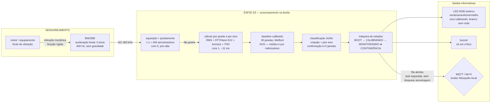
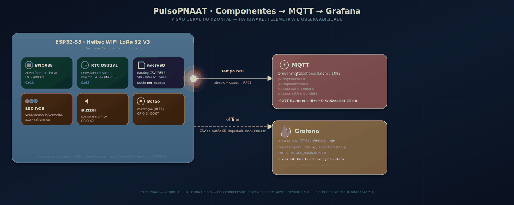

<p align="center">
  

</p>

# PulsoPNAAT: Manutenção Preditiva por Análise de Vibração
 
TCC: Trabalho de Conclusão da Capacitação PNAAT 2026 (FIT · MCTI Futuro · Softex)
 
Um nó de borda (ESP32-S3 + BNO085) fixado à carcaça de um equipamento rotativo monitora
a vibração triaxial em tempo real, calcula métricas de severidade na borda (Edge AI) e
emite alertas antes da falha, via MQTT e sinalização local (LED + buzzer).
 
Equipe: Jetro Kepler Gomes Alencar Gonzaga Viana · Jhonatan Gonçalves Pereira ·
José Adiel Calixto Serafim · Lucas Vinicius Santos Leonel
 
---
 
## Sumário
 
1. [Por que este projeto existe](#1-por-que-este-projeto-existe) - dor, resultado, limites
2. [Arquitetura](#2-arquitetura) - diagrama de blocos, fluxo de dados, tasks, estados
3. [Hardware e montagem](#3-hardware-e-montagem) - peças, pinagem I2C, LED/buzzer, RTC, microSD, fixação
4. [Software e estrutura do repositório](#4-software-e-estrutura-do-repositório) - pastas e arquivos
5. [Dependências](#5-dependências) - bibliotecas, plataformas, ferramentas
6. [Pré-requisitos](#6-pré-requisitos) - o que instalar antes de começar
7. [Configuração](#7-configuração) - Wi-Fi, MQTT, equipamento, pinos (`menuconfig`)
   - 7.1 [Rede e broker MQTT da bancada](#71-rede-e-broker-mqtt-da-bancada-para-reproduzirgravar-o-vídeo)
8. [Como compilar, gravar e monitorar](#8-como-compilar-gravar-e-monitorar) - passo a passo reprodutível
   - 8.1 [Partição "factory" pequena demais](#81-partição-factory-pequena-demais-app-partition-is-too-small)
9. [Como operar](#9-como-operar) - calibrar, classificar, LED/buzzer, MQTT, demo
   - 9.5 [Data logging (microSD + RTC)](#95-data-logging-microsd--rtc--para-que-serve)
   - 9.6 [Observabilidade: MQTT → Grafana](#96-observabilidade-mqtt--grafana)
   - 9.7 [Detector de anomalia (Edge AI em modo sombra)](#97-detector-de-anomalia-edge-ai-em-modo-sombra-54)
10. [Como testar](#10-como-testar) - suíte Unity on-target
11. [Critérios de sucesso (KPIs)](#11-critérios-de-sucesso-kpis)
12. [Solução de problemas](#12-solução-de-problemas)
13. [Convenções de contribuição](#13-convenções-de-contribuição)
14. [Links e artefatos do projeto](#14-links-e-artefatos-do-projeto)
---
 
## 1. Por que este projeto existe?
 
A dor (Cenário 8, manufatura pesada): motores elétricos e rolamentos sofrem desgaste
progressivo que altera o padrão de vibração *semanas antes* da falha catastrófica, um
sinal imperceptível à supervisão humana. Sem acompanhamento preditivo, a manutenção opera
no modo reativo: a primeira indicação do problema é a própria parada não programada
(custo emergencial + perda de produção).
 
O que o sistema faz: cada janela de 1 s de vibração vira 6 métricas por eixo
(RMS, 1x, 2x, banda 3x-5x, kurtosis, THD), comparadas a um baseline calibrado do próprio
equipamento. O estado (normal / atenção / crítico) sai por votação entre métricas, com o
pior eixo dando o estado do equipamento. Saída puramente informativa: o nó observa
e informa, nunca atua sobre o motor.
 
O que o sistema explicitamente NÃO faz (limites declarados do projeto):
 
- Não interrompe o motor nem aciona atuadores (exigiria contatores, isolamento galvânico,
  segurança industrial, fora do escopo).
- Não diagnostica causa raiz com precisão plena (indica *tendências*: pico em 1x sugere
  desbalanceamento, 2x desalinhamento etc., não substitui laudo técnico).
- Não detecta falhas de rolamento em alta frequência (BPFO/BPFI, 1-10 kHz): a 400 Hz de
  amostragem, o Nyquist de 200 Hz não alcança essa faixa.
- Não arquiva em nuvem nem faz análise histórica avançada.
- Não usa o rádio LoRa da placa; a rede é Wi-Fi + MQTT, com modo de contingência local
  quando o Wi-Fi cai.
---
 
## 2. Arquitetura
 
### 2.1 Diagrama de blocos (fluxo de dados)
 

 
Leitura do fluxo: vibração → BNO085 (I2C) → amostragem (core 0) → fila →
processamento (core 1) → comparação com baseline → classificação → dois destinos
independentes: sinalização local imediata (LED/buzzer) e publicação remota (MQTT).
Queda de Wi-Fi não trava a amostragem: o nó entra em `CONTINGÊNCIA`, sinaliza "sem
conectividade" e tenta reconectar sozinho.
 
 ## Protótipo

 
### 2.2 Elementos e relações
 
| Bloco | Elemento | Papel | Relação / fluxo |
|---|---|---|---|
| Sensoriamento | BNO085 (módulo GY-BNO085 do kit) | Aceleração linear triaxial (X, Y, Z) em m/s², já sem gravidade (fusão no sensor) | I2C 400 kHz → ESP32-S3; fixado rigidamente à carcaça |
| Processamento | ESP32-S3 (Heltec WiFi LoRa 32 V3), FreeRTOS | Amostragem (core 0) + cálculo + classificação (core 1) | Janelas via Queue; alertas via Queue dedicada |
| Baseline | 30 janelas saudáveis, Welford, NVS | "Assinatura saudável" por métrica e eixo | Calibração comandada (botão/serial/MQTT); sem baseline não há classificação |
| Decisão | Limiares mean+3σ / mean+6σ, votação, pior eixo, confirmação k=3 | Estado normal/atenção/crítico | Blips de 1 janela não viram alarme; falha real persiste e confirma |
| Conectividade | Wi-Fi + MQTT (broker Mosquitto local) | Alerta remoto acionável | Task de baixa prioridade; nunca bloqueia a amostragem |
| Sinalização | LED RGB externo + buzzer ativo | Estado visível/audível no chão de fábrica | Buzzer só em crítico; falha de LED/buzzer não derruba o monitoramento |
| Robustez | Watchdog, filtro Hampel + rejeição de spikes | Operação contínua | Spikes fisicamente impossíveis são descartados antes da estatística |
 
> No código, a conectividade está desdobrada em dois componentes:
> `components/wifi_config/` (station + retries até `WIFI_MAX_RETRY`, default 5) e
> `components/mqtt_client/` (transporte + `mqtt_payloads.c` puro).
 
### 2.3 Máquina de estados
 
```
BOOT → CALIBRANDO → MONITORANDO ⇄ CONTINGÊNCIA
```
 
- BOOT: inicializa hardware; sem baseline válido, descarta janelas (LED apagado).
  Reboot com baseline salvo em NVS entra direto em `MONITORANDO`.
- CALIBRANDO: 30 janelas (~30 s) com o equipamento em regime saudável; LED azul
  piscando ("não perturbe o equipamento"). Não classifica.
- MONITORANDO: classifica cada janela, atualiza LED/buzzer, publica alertas.
- CONTINGÊNCIA: Wi-Fi indisponível; LED branco piscando; reconexão automática;
  buzzer continua reservado ao estado crítico.
---
 
## 3. Hardware e montagem
 
### 3.1 Peças
 
| Item | Modelo | Observação |
|---|---|---|
| Placa de processamento | Heltec WiFi LoRa 32 V3 (ESP32-S3) | Placa padrão do kit PNAAT; rádio LoRa presente mas não usado pelo firmware |
| Sensor | Módulo GY-BNO085 (acelerômetro triaxial) | Único dispositivo com acelerometria do kit; lido em modo I2C |
| Relógio de tempo real | RTC DS3231 | Timestamp absoluto para o datalog; mesmo barramento I2C do BNO085 (ver §3.5) |
| Armazenamento | Módulo microSD (leitor SPI) | Datalog em CSV com rotação por tempo (ver §3.5 e §9.5) |
| Sinalização | LED RGB externo (3 canais discretos) + resistores ~220-330 Ω por canal | A Heltec V3 não tem LED RGB endereçável utilizável, usar LED externo |
| Alerta sonoro | Buzzer ativo (liga/desliga por nível digital, sem PWM) | Soa apenas em estado crítico |
| Fixação | Suporte/cola rígida + parafusos | Acoplamento rígido à carcaça é pré-condição de leitura confiável |
 
### 3.2 Ligação I2C: ESP32-S3 (Heltec V3) × GY-BNO085
 
| BNO085 | ESP32-S3 | Sinal / nota |
|---|---|---|
| VCC | 3V3 | Alimentação 3,3 V |
| GND | GND | Referência comum |
| SDA | GPIO 6 | I2C data (`APP_BNO085_I2C_SDA_GPIO`, default 6) |
| SCL | GPIO 7 | I2C clock (`APP_BNO085_I2C_SCL_GPIO`, default 7) |
| INT (H_INTN) | GPIO 5 | Data-ready, ativo baixo |
| RST (NRST) | GPIO 4 | Reset, ativo baixo |
| AD0/SA0 | GND | Seleciona o endereço 0x4A (ver §3.3) |
| PS0 + PS1 | GND | Obrigatório: modo I2C; flutuando o sensor não responde |
| VCC do AD0/PSx | - | Não ligar em VCC salvo para mudar o endereço (ver abaixo) |
 
Frequência do barramento: 400 kHz (`APP_BNO085_I2C_FREQ_HZ`). Mantenha os fios I2C
curtos e afastados dos cabos do motor (ruído eletromagnético próximo ao motor).
 
### 3.3 Endereço I2C: use 0x4A (0x28 NÃO funciona neste setup)
 
- Default do firmware: `0x4A` (`APP_BNO085_I2C_ADDR` em `main/Kconfig.projbuild`).
- 0x28/0x29 são endereços do BNO055, não do BNO085. Com o módulo GY-BNO085 do kit
  ligado à Heltec LoRa V3, `0x28` recebe NACK (o sensor não responde).
- Regra do BNO085 (datasheet): SA0/AD0 em GND → 0x4A; em VCC → 0x4B.
- Se o scanner I2C não achar nada em 0x4A: confira PS0/PS1 em GND, alimentação 3V3 e
  SDA/SCL (6/7) antes de suspeitar de defeito.
### 3.4 Sinalização local e botão
 
| Função | GPIO (default) | Nota |
|---|---|---|
| LED canal R | GPIO 39 | Vermelho = crítico; R+G = amarelo; R+G+B = branco (sem rede) |
| LED canal G | GPIO 40 | Verde fixo = normal |
| LED canal B | GPIO 41 | Azul piscando = calibrando |
| Buzzer ativo | GPIO 42 | Nível liga/desliga; polaridade em `menuconfig` |
| Botão calibração | GPIO 0 | Botão BOOT onboard, ativo baixo, pull-up interno |
 
Polaridade (catodo comum = nível alto acende, default; anodo comum = desmarcar
`PULSOPNAAT_LED_ATIVO_ALTO`), canais desativáveis com GPIO negativo (LED de cor única)
e GPIOs, tudo em `idf.py menuconfig` → componente `alert_manager`. Na Heltec V3 evite
GPIOs 8-14 (rádio LoRa) e 17/18/21 (OLED).
 
### 3.5 RTC DS3231 e módulo microSD (armazenamento local)

**RTC DS3231 — mesmo barramento I2C do BNO085:**

| DS3231 | ESP32-S3 | Sinal / nota |
|---|---|---|
| VCC | 3V3 | Alimentação 3,3 V |
| GND | GND | Referência comum |
| SDA | GPIO 6 | Mesmo pino/barramento do BNO085 |
| SCL | GPIO 7 | Mesmo pino/barramento do BNO085 |
| Endereço I2C | — | `0x68` (fixo de fábrica) |

**Módulo microSD — SPI dedicado:**

| microSD | ESP32-S3 | Sinal / nota |
|---|---|---|
| VCC | 5V | Módulo tem regulador (AMS1117): em 3V3 o cartão recebe ~2,2 V e a inicialização falha no ACMD41 (`0x107`) |
| GND | GND | Referência comum |
| SCK | GPIO 33 | |
| MOSI | GPIO 34 | |
| MISO | GPIO 47 | Costuma vir serigrafado "MOSO" no módulo |
| CS | GPIO 48 | |

Cartão precisa estar formatado em FAT32 (não exFAT).

 ## Resumo Visual pinout


---
 
## 4. Software e estrutura do repositório
 
Cada linha abaixo corresponde a um caminho real neste repositório (critério de
rastreabilidade da banca: o que o README cita, o explorador de arquivos encontra).
 
```
.
├── main/                          firmware: wiring do sistema
│   ├── main.c                     app_main — filas, tasks com pinning, pipeline completo
│   ├── Kconfig.projbuild          menu "PulsoPNAAT": I2C/GPIO, aquisição, RPM, node ID
│   ├── idf_component.yml          dependência rinku404/bno085 v1.2.0
│   └── CMakeLists.txt             liga main aos componentes
├── components/
│   ├── i2c_config/                barramento I2C master + dispositivo BNO085
│   │   ├── i2c_config.c  include/i2c_config.h  CMakeLists.txt
│   ├── vibration_sensor/          aquisição LINEAR_ACCELERATION (0x04) @400 Hz, janelas 1 s
│   │   ├── vibration_sensor.c  include/vibration_sensor.h  CMakeLists.txt
│   ├── signal_processing/         matemática pura: RMS, Hann, FFT-512 (esp-dsp), kurtosis, THD
│   │   ├── signal_processing.c  include/signal_processing.h
│   │   ├── idf_component.yml      espressif/esp-dsp ^1.6.0 (consumidor direto da FFT)
│   │   └── test/test_signal_processing.c
│   ├── baseline/                  calibração comandada (30 janelas, Welford) + NVS
│   │   ├── baseline.c  baseline_nvs.c  include/baseline.h  include/baseline_nvs.h
│   │   └── test/test_baseline.c
│   ├── alert_manager/             classificação 3σ/6σ, votação/pior eixo, máquina de estados, LED/buzzer
│   │   ├── alert_manager.c (núcleo puro)  alerta_servico.c (face on-device)
│   │   ├── include/alert_manager.h  include/alerta_servico.h  Kconfig  CMakeLists.txt
│   │   └── test/test_alert_manager.c
│   ├── wifi_config/               Wi-Fi station + reconexão (Kconfig: SSID/senha)
│   │   ├── wifi_config.c  include/wifi_config.h  Kconfig  CMakeLists.txt
│   ├── mqtt_client/                cliente MQTT + formatação de payloads (núcleo puro)
│   │   ├── pnaat_mqtt_client.c  mqtt_payloads.c
│   │   ├── include/pnaat_mqtt_client.h  include/mqtt_payloads.h
│   │   ├── Kconfig (broker URI)  CMakeLists.txt
│   │   └── test/test_mqtt_client.c
│   └── storage/                    data logging em microSD + RTC DS3231 (RF12/RNF09)
│       ├── storage.c  rtc_ds3231.c
│       ├── include/storage.h  include/rtc_ds3231.h  Kconfig  CMakeLists.txt
├── test_app/                      app de teste on-target (Unity no ESP32-S3)
│   ├── main/test_app_main.c       runner: registra rodar_testes_<comp>() de cada suíte
│   ├── CMakeLists.txt             inclui só os componentes com corpus de teste
│   └── sdkconfig.defaults
├── docs/img/fit_logo.png          logo institucional (usado no topo deste README)
├── dependencies.lock              versões resolvidas (esp-dsp 1.8.2, bno085 1.2.0, IDF 5.5.5)
└── README.md                      este manual (você está aqui)
```
 
Lógica de organização: matemática/estado (`signal_processing`, `baseline`,
`alert_manager`, `mqtt_payloads`) é pura (sem ESP-IDF, sem I/O, sem estado global)
para ser testável isolada do hardware. Integração de
hardware (I2C, Wi-Fi/MQTT, GPIO, SD/RTC) vive nas bordas (`i2c_config`,
`vibration_sensor`, `wifi_config`, `pnaat_mqtt_client`, `alerta_servico`, `storage`,
`app_main`) e é validada on-device.
 
---
 
## 5. Dependências
 
| Categoria | Dependência | Versão | Origem / registro | Para quê |
|---|---|---|---|---|
| Plataforma | ESP-IDF | ≥ 5.5 (resolvido: 5.5.5) | instalador Espressif; `dependencies.lock` | Toolchain, FreeRTOS, Wi-Fi/MQTT, NVS, Unity |
| Alvo | ESP32-S3 | - | `idf.py set-target esp32s3` | MCU da Heltec V3 |
| Driver sensor | `rinku404/bno085` | 1.2.0 | `main/idf_component.yml` (registry Espressif) | HAL SH-2 I2C do BNO085 |
| DSP | `espressif/esp-dsp` | ^1.6.0 (resolvido: 1.8.2) | `components/signal_processing/idf_component.yml` | FFT (`dsps_fft`), janela Hann, cálculo da janela com folga (~11 ms/janela) |
| Teste | `unity` (componente ESP-IDF) | 2.6.0 | provido pelo ESP-IDF | Corpus em `components/*/test/`, executado on-target |
| Firmware | - | C/C++ sobre FreeRTOS | `main/main.c`, `components/*` | Aquisição, DSP, classificação, conectividade |
| Broker MQTT | Mosquitto (local) ou broker público de teste | qualquer recente | externo ao repo | Recebe `pulsopnaat/#` (tópicos e broker de bancada em §7.1/§9.3) |
| Ferramentas host | git, Python 3 (via ESP-IDF), driver USB-serial da Heltec | - | SO do desenvolvedor | Clone, build/flash/monitor, console serial |
 
> Nada além do ESP-IDF precisa ser instalado manualmente para as bibliotecas: `idf.py
> build` resolve `bno085` e `esp-dsp` pelo registry e trava as versões em
> `dependencies.lock`.
 
---
 
## 6. Pré-requisitos
 
1. ESP-IDF ≥ 5.5 instalado (com o ambiente exportado a cada sessão, ver §8).
2. Placa Heltec WiFi LoRa 32 V3 + módulo GY-BNO085 ligados conforme §3.2
   (atenção ao endereço 0x4A e a PS0/PS1 em GND).
3. Cabo USB de dados (não só de carga) + driver USB-serial reconhecendo a placa.
4. Rede Wi-Fi **2,4 GHz** acessível + broker MQTT rodando nela (para a fase com
   conectividade; aquisição/classificação/sinalização funcionam sem rede). O ESP32-S3
   **não conecta em 5 GHz** — se usar hotspot de celular, force a banda 2,4 GHz
   explicitamente (muitos hotspots sobem em 5 GHz por padrão e a placa não vê a rede).
5. Git.
---
 
## 7. Configuração
 
Toda configuração é via `menuconfig`. Os símbolos ficam em `main/Kconfig.projbuild` (I2C/aquisição/RPM/node),
`components/alert_manager/Kconfig` (LED/buzzer/botão/k), `components/wifi_config/Kconfig` (SSID/senha/retries)
e `components/mqtt_client/Kconfig` (broker URI). Nenhuma credencial vai no código-fonte:
 
```bash
idf.py menuconfig
```
 
| Onde | Parâmetro | Default | O que significa |
|---|---|---|---|
| `PulsoPNAAT → I2C & GPIO` | SDA / SCL / INT / RST | 6 / 7 / 5 / 4 | Pinagem da §3.2 |
| `PulsoPNAAT → I2C & GPIO` | I2C Address | 0x4A | SA0=GND; 0x4B se SA0=VCC; 0x28 não responde |
| `PulsoPNAAT → I2C & GPIO` | I2C Clock | 400 kHz | Barramento do sensor |
| `PulsoPNAAT → Aquisição` | Reporte LINEAR_ACCELERATION | 2500 µs | Pede 400 Hz; o sensor limita ao máximo do reporte → fs = 400 Hz, N = 400, Nyquist 200 Hz |
| `PulsoPNAAT → Aquisição` | Fila de janelas | 2 | Janelas de ~4,8 KB; cheia → descarta a mais antiga (amostragem nunca bloqueia) |
| `PulsoPNAAT → Equipamento` | RPM nominal | 1500 | Define f0 = RPM/60 (25 Hz); harmônicos 1x/2x/banda 3x-5x; por equipamento, sem autodetecção |
| `PulsoPNAAT → Conectividade` | Node ID | `pulsopnaat-01` | Campo `node` do JSON |
| `WiFi Configuration` | SSID / Password / retries | "" / "" / 5 | Credenciais da rede; ficam só na configuração local; **rede precisa ser 2,4 GHz** (ver §6) |
| `MQTT Client` | Broker URI | `mqtt://localhost:1883` | Apontar para o broker da bancada (padrão de testes em §7.1) |
| `alert_manager` | LED R/G/B, buzzer, botão, k confirmação | 39/40/41, 42, 0, 3 | Ver §3.4; k = janelas consecutivas para confirmar mudança de estado |
| `PulsoPNAAT → Armazenamento` | SD SCK/MOSI/MISO/CS | 33/34/47/48 | Ver §3.5 |
| `PulsoPNAAT → Armazenamento` | SD clock máximo | 4000 kHz | Mais tolerante a fiação de protoboard |
| `PulsoPNAAT → Armazenamento` | Rotação/espaço mínimo | 15 min / 10 MB | Ver §9.5 |
| `PulsoPNAAT → Armazenamento` | Endereço I2C do RTC | 0x68 | Mesmo barramento do BNO085 |
| `PulsoPNAAT → Amostragem` | Watchdog timeout/backoff | 3000/2000 ms | Ver §12.1 |
 
Notas:
 
- O serial imprime no boot a configuração efetiva (f0, taxa) e, por janela, a taxa
  efetiva medida pelos timestamps SH-2, a fs efetiva é a que vale no mapeamento de
  bins (fallback: nominal 400 Hz).
- Baseline persiste em NVS (namespace `pnaat`, chave `baseline`, 156 B com mágica+CRC).
  Registro corrompido é descartado com log, nunca interpretado.
### 7.1 Rede e broker MQTT da bancada (para reproduzir/gravar o vídeo)
 
**Wi-Fi:** hotspot ou roteador em **2,4 GHz** — ver aviso em §6, o módulo não enxerga
rede 5 GHz.
 
**Broker MQTT usado nos testes de bancada** (broker público — ver ressalva abaixo):
 
| Campo | Valor |
|---|---|
| Link do broker | `mqtt://broker.mqttdashboard.com` |
| Host | `broker.mqttdashboard.com` |
| Porta | `1883` |
| Protocolo | `mqtt://` |
| Encryption (TLS) | desligado (o firmware conecta sem TLS) |
| Validate certificate | desligado |
| Username / Password | em branco |
 
Dashboard cliente pra acompanhar sem instalar nada — **MQTT Websocket Client**:
<https://www.hivemq.com/demos/websocket-client/> (aponta pro mesmo host acima).
 
> É um broker **público e compartilhado** por milhares de outros clientes — pode ficar
> instável sob carga (desconexões e timeouts aleatórios, ver §12). Para uma
> apresentação decisiva ou coleta de dados longa, prefira um Mosquitto local
> (`MQTT Client → Broker URI` apontando pro IP da bancada, ver §8).
 
**Tópicos:**
 
| Tópico | Conteúdo |
|---|---|
| `pulsopnaat/sensor/data` | dados brutos/periódicos do sensor |
| `pulsopnaat/alert` | alerta ao confirmar atenção/crítico (RF05, ver §9.3) |
| `pulsopnaat/status` | status do nó ao conectar e sob comando |
| `pulsopnaat/command` | comandos pro nó (`calibrar`, `status`) |
| `pulsopnaat/#` | assina tudo de uma vez (bom pro MQTT Explorer ou pro dashboard acima) |
 
---
 
## 8. Como compilar, gravar e monitorar
 
Do zero, em ambiente limpo (reprodutível):
 
```bash
# 0. Clonar
git clone git@github.com:jhonatan-goncalves-pereira/pulsopnaat.git
cd pulsopnaat
 
# 1. Ativar o ESP-IDF (toda sessão/shell nova. caminho pode variar dependendo do setup)
source ~/.espressif/tools/activate_idf_v5.5.5.sh
 
# 2. Selecionar o alvo (uma vez por clone)
idf.py set-target esp32s3
 
# 3. (Opcional) ajustar Wi-Fi/MQTT/RPM/pinos
idf.py menuconfig
 
# 3b. (Para a fase com conectividade) rede 2,4 GHz + broker MQTT (local ou o
# público de bancada em §7.1) e apontar `MQTT Client → Broker URI` pra ele.
# O default `mqtt://localhost:1883` só vale com broker no próprio host.
# Sem rede, aquisição/classificação/sinalização seguem normais (CONTINGÊNCIA).
 
# 4. Compilar
idf.py build
 
# 5. Gravar e abrir o monitor serial
idf.py flash monitor
# sair do monitor: Ctrl+]
```
 
Se `idf.py build` termina sem erro, toolchain + `bno085` + `esp-dsp` estão resolvidos.
O serial mostra CSV de 18 valores/janela (6 métricas × 3 eixos) mais logs de estado:
 
```
# rms_x,h1x_x,h2x_x,b3x5_x,kurt_x,thd_x,rms_y,...,thd_z   (m/s²; kurt/THD adimensionais)
```
 
> Apagou algo da NVS ou trocou de bancada? `idf.py erase-flash` limpa o baseline salvo
> (o nó volta a pedir calibração, comportamento esperado, não defeito).
 
### 8.1 Partição "factory" pequena demais (`app partition is too small`)
 
Com o componente `storage` (FATFS + SDMMC + mbedTLS) integrado, o binário passa de
1 MB — a tabela de partições single-app padrão do ESP-IDF só reserva 1 MB pro app. A
flash é de 2 MB, então sobra espaço; só falta a tabela de partições usar mais dele:
 
```bash
idf.py menuconfig
# Navegue até "Partition Table" → "Partition Table" e mude de
# "Single factory app, no OTA" para "Single factory app (large), no OTA".
# Isso troca o CSV interno do IDF para um que reserva quase toda a flash de
# 2 MB pro app (bem mais que os atuais 1 MB), sem precisar escrever um
# partitions.csv customizado.
# S (salvar), Q (sair)
 
idf.py fullclean build flash monitor
```
 
`fullclean` é importante aqui — a partição muda de offset/tamanho, um build
incremental por cima da tabela antiga pode dar erro de md5/offset no flash.
 
---
 
## 9. Como operar
 
### 9.1 Calibrar (obrigatório antes de classificar)
 
Sem baseline válido o nó fica em `BOOT` descartando janelas. Não há classificação
sem baseline (decisão travada). Com o equipamento em regime saudável estável
(passada a partida/aquecimento):
 
- Botão: pressione o BOOT (GPIO 0), ou
- Serial: digite `calibrar` (insensível a maiúsculas), ou
- MQTT: publique `calibrar` em `pulsopnaat/command`.
LED azul piscando por 30 janelas (~30 s) → baseline (média/σ por métrica e eixo)
salvo em NVS → `MONITORANDO`. Reboot carrega da NVS e volta direto a monitorar.
Diagnóstico a qualquer momento: comando `status` (serial ou MQTT), estado da máquina,
estado do equipamento, baseline presente/ausente, uptime e RMS médio±σ.
 
### 9.2 Classificação (o que cada cor significa)
 
| Estado | Condição (por janela, após confirmação k=3) | LED | Buzzer |
|---|---|---|---|
| Verde (normal) | nenhuma métrica além de mean+3σ | verde fixo | off |
| Amarelo (atenção) | 1-2 métricas além de mean+3σ | amarelo (R+G) piscando | off |
| Vermelho (crítico) | 1 métrica além de mean+6σ ou 3 em atenção | vermelho fixo | on |
| Sem conectividade | Wi-Fi fora (máquina em CONTINGÊNCIA) | branco (R+G+B) piscando | só se equipamento crítico |
 
Estado do equipamento = pior eixo (falha uniaxial não é diluída). A mudança só se
efetiva após 3 janelas consecutivas do mesmo candidato (histerese simétrica, inclusive
na volta ao verde). Blips de 1 janela (ex.: picos de kurtosis sobre ruído de
quantização em repouso) não flipam o alarme; falha real persiste e confirma em ~3 s.
 
### 9.3 MQTT (alerta remoto)
 
| Tópico | Direção | Conteúdo |
|---|---|---|
| `pulsopnaat/alert` | nó → broker | `{"node":"...","ts_us":…,"estado":"...","rms_x":…,"rms_y":…,"rms_z":…}` ao confirmar atenção/crítico |
| `pulsopnaat/status` | nó → broker | `{"node":"...","maquina":"...","equipamento":"...","baseline":true,"uptime_s":…}` ao conectar e sob comando |
| `pulsopnaat/command` | broker → nó | `calibrar`, `status` ou rótulo do dataset `saudavel` / `falha` / `sem_rotulo` (RF15, §9.7) — comparação exata, `calibrar\n` não dispara |
 
Dados de conexão (host, porta, dashboard, todos os tópicos) em §7.1.
 
Publicação em task separada de baixa prioridade: rede nunca bloqueia amostragem.
Formato (`mqtt_formatar_alerta` em `components/mqtt_client/mqtt_payloads.c`):
node, ts_us, estado + RMS por eixo (~150 B, folga no buffer de 192 B em `main/main.c:74`).
 
### 9.4 Demo de anomalia (roteiro de bancada)
 
1. Nó em `MONITORANDO` verde, equipamento saudável.
2. Induza vibração (toque/estímulo na carcaça).
3. LED amarelo → vermelho + buzzer em ~3 s; alerta em `pulsopnaat/alert`.
4. Remova o estímulo → após 3 janelas limpas, volta a verde.

### 9.5 Data logging (microSD + RTC) — para que serve

RF12/RNF09. Cada janela processada (fora do estado `BOOT`) é enfileirada para uma task
**dedicada de baixa prioridade** que grava um CSV no cartão — a amostragem e o DSP
**nunca** esperam por I/O de SD (RNF09). Timestamp vem do RTC DS3231 (§3.5), no mesmo
barramento I2C do BNO085; sem RTC, cai para `boot+<segundos>`.

**Por que isso importa além de "ter um log":**

- **Constrói o dataset rotulado** necessário antes de sequer cogitar o detector de
  anomalia offline (Mahalanobis/K-means) mencionado em §1 — não dá pra treinar nada
  sem operação saudável real registrada.
- **Evidência auditável** por trás de cada alerta — RF05 já manda o payload MQTT com
  o valor de cada métrica, mas o CSV é o que sustenta uma investigação posterior.

**Onde/como:**

- `/sdcard/pulso/log_<timestamp ou boot_ms>.csv`, append, sobrevive a reboot.
- Hora do RTC acertada automaticamente via SNTP (`pool.ntp.org`) quando o Wi-Fi
  conecta e ressincronizada a cada hora; sem rede, o DS3231 mantém a última hora boa.
- Cartão ausente ou que falhou ao montar: a task de storage tenta montar de novo a
  cada 10 s, então dá pra reencaixar o cartão sem reiniciar o nó.
- Rotação por tempo (`CONFIG_PULSOPNAAT_LOG_ROTACAO_MIN`, default 15 min): cada
  arquivo cobre uma janela fixa — o histórico completo é a sequência de arquivos,
  não um único CSV gigante.
- Poda por capacidade (`CONFIG_PULSOPNAAT_LOG_ESPACO_MINIMO_KB`, default 10 MB
  livres): rede de segurança, **não** é retenção por padrão — o padrão é acúmulo
  persistente. Só apaga os `.csv` mais antigos se o espaço livre cair abaixo do
  limite, pra um cartão cheio nunca travar a escrita (RNF09).
- Falha de SD ou RTC **degrada, não trava**: monitoramento, LED/buzzer e MQTT
  seguem normalmente; só o log fica ausente (contabilizado em log agregado, não
  por linha, pra não floodar o console).

**Formato do CSV:**
´´´
timestamp,node_id,estado_maquina,estado_equipamento,rms_x,h1x_x,h2x_x,b3x5_x,kurt_x,thd_x,rms_y,...,thd_z,rotulo,score_anomalia,anomalia
2026-09-15T21:09:30Z,pulsopnaat-01,MONITORANDO,VERDE,0.0224,0.0036,...,saudavel,1.8420,0
´´´

### 9.6 Observabilidade: MQTT → Grafana



O nó tem **dois caminhos de observabilidade** independentes, cada um servindo um
propósito diferente:

- **Tempo real (MQTT):** alertas e status chegam imediatamente em `pulsopnaat/alert` e
  `pulsopnaat/status` (§9.3) — bom para notificação acionável da equipe de manutenção,
  visualizável no MQTT Explorer ou no dashboard HiveMQ (§7.1).
- **Histórico (Grafana):** o CSV gravado no cartão SD (§9.5) é retirado do cartão e
  importado no Grafana via plugin CSV/Infinity — bom para análise de tendência ao
  longo do tempo, com série temporal de `rms_x/y/z` colorida por `estado_equipamento`.

**Esse segundo caminho é offline/pós-coleta**, não uma integração ao vivo entre MQTT e
Grafana — o Grafana não está plugado no broker MQTT neste projeto, ele lê o arquivo CSV
já exportado. Isso é intencional: a rotação por tempo (§9.5) mantém cada CSV pequeno o
bastante pra importar sem reprocessar o cartão inteiro a cada consulta.

Passo a passo pra reproduzir a visualização:

1. Deixe o nó rodando até fechar pelo menos um arquivo completo de log (§9.5).
2. Retire o cartão, leia num adaptador USB no PC.
3. Grafana → plugin **Infinity** (ou datasource CSV nativo) → aponta pro `.csv`.
4. Série temporal com `timestamp` no eixo X e `rms_x`/`rms_y`/`rms_z` como séries;
   colorir por `estado_equipamento` pra visualizar a transição verde→vermelho.

### 9.7 Detector de anomalia (Edge AI em modo sombra, §5.4)

Complementa a votação por limiares com um detector não supervisionado: distância de
Mahalanobis do vetor de 18 métricas contra a operação saudável do próprio equipamento.
O treino é offline (Python + `numpy`, com os CSVs do cartão) e o ESP32 só calcula o score
a cada janela. Roda em **modo sombra**: grava `score_anomalia`/`anomalia` no CSV e loga as
transições, mas LED, buzzer e alertas MQTT continuam decididos pelos limiares até o
relatório mostrar que o detector é melhor (portão de decisão da §5.4).

Fluxo completo:

1. Calibre o baseline com o equipamento em regime saudável (§9.1).
2. Rotule a coleta (RF15), pela serial ou publicando em `pulsopnaat/command`:
   `saudavel` e deixe rodando alguns minutos; `falha` e induza a falha (ex.: peso numa pá
   do ventilador) por 1-2 min; `sem_rotulo` encerra a marcação.
3. Tire o cartão e treine:
   ```bash
   python tools/classificador/treinar_detector.py F:/pulso
   ```
   Gera `components/anomaly_detector/modelo_anomalia.h` e
   `tools/classificador/relatorio_detector.md` (matriz de confusão do detector × limiares,
   taxa de falso positivo e o veredito do portão de decisão).
4. `idf.py build flash`: o boot mostra `detector de anomalia embarcado (modo sombra)` e o
   comando `status` passa a exibir `score`, `limiar` e `rotulo`.

Parâmetros: `--quantil-limiar` (padrão 0,995 das distâncias de treino) e `--fracao-teste`
(padrão: 30% finais das janelas saudáveis, em ordem cronológica). Sem treino, o
`modelo_anomalia.h` é um placeholder e o firmware roda sem detector.
 ---
## 10. Como testar
 
Corpus Unity (v2.6.0, componente `unity` do ESP-IDF) em `components/*/test/`,
executado on-target, valida o comportamento float e o esp-dsp no próprio Xtensa:
 
```bash
idf.py -C test_app set-target esp32s3   # uma vez
idf.py -C test_app build flash monitor
# resumo no serial: "N Tests 0 Failures 0 Ignored / OK"
```
 
| Suíte | Arquivo | O que cobre |
|---|---|---|
| `signal_processing` | `components/signal_processing/test/test_signal_processing.c` | RMS, cadeia espectral (senoide em f0/2f0/4f0, THD), kurtosis, `metricas_para_vetor` |
| `baseline` | `components/baseline/test/test_baseline.c` | Welford exato, coleta parcial/excedente, validação, serialização NVS (mágica/versão/CRC) |
| `alert_manager` | `components/alert_manager/test/test_alert_manager.c` | Limiares 3σ/6σ, votação, pior eixo, máquina de estados, sinalização |
| `mqtt_client` | `components/mqtt_client/test/test_mqtt_client.c` | Formatação dos payloads de alerta/status |
| `anomaly_detector` | `components/anomaly_detector/test/test_anomaly_detector.c` | Ordem/transformação das features, Mahalanobis (identidade, escala, precisão cheia), limiar, defensivos, coerência do modelo embarcado |
 
Nova suíte: criar `components/<comp>/test/test_<comp>.c` (API `TEST_ASSERT_*`, função
`rodar_testes_<comp>()`) e registrá-la no runner
[`test_app/main/test_app_main.c`](test_app/main/test_app_main.c). Integração de hardware
(I2C a 400 Hz, latência < 1 s, Wi-Fi/MQTT + reconexão, LED/buzzer, watchdog,
estabilidade 2 h) é validada on-device por observação direta (serial, CSV, cronômetro).
 
---
 
## 11. Critérios de sucesso (KPIs)
 
| Critério | Meta mensurável | Onde verificar |
|---|---|---|
| Acurácia de detecção | ≥ 85% em 20 janelas (10 saudáveis + 10 erro induzido) | Campanha de validação, matriz VP/VN/FP/FN |
| Falsos positivos | ≤ 2 alertas em 1 h de operação normal | Log serial |
| Latência de processamento | Cálculo da janela < 1 s | Medido on-device: ~11 ms (folga de ~99%) |
| Resiliência de rede | Queda de Wi-Fi não trava a amostragem; retry automático até `WIFI_MAX_RETRY` em modo CONTINGÊNCIA | Teste de queda proposital (serial + LED branco) |
| Estabilidade | ≥ 2 h contínuas sem travar, sem leak, sem intervenção | Monitoramento de turno |
 
---
 
## 12. Solução de problemas
 
| Sintoma | Causa provável | Ação |
|---|---|---|
| Sensor não responde / NACK em `0x28` | Endereço errado: 0x28 é do BNO055 | Usar 0x4A (SA0=GND) ou 0x4B (SA0=VCC) |
| Nada em 0x4A no scanner | PS0/PS1 flutuando, VCC/GND ou SDA/SCL trocados | PS0+PS1→GND; conferir §3.2; fios curtos |
| Nó parado em `BOOT`, "sem baseline" | Comportamento esperado, não defeito | Executar `calibrar` com regime saudável (§9.1) |
| Estado flipando a cada janela em repouso | Kurtosis sobre ruído de quantização (picos 20-400 de 1 janela) | Esperado e absorvido pela confirmação k=3; não zerar k sem motivo |
| `status` mostra baseline ausente após reboot | NVS apagada / outro firmware gravado | Recalibrar; `baseline_carregar_nvs` loga o motivo |
| Wi-Fi não conecta / hotspot não aparece | Hotspot subiu em 5 GHz | O ESP32-S3 só enxerga 2,4 GHz — force a banda no celular/roteador (§6) |
| Wi-Fi conecta mas sem alerta remoto | Broker URI apontando para `localhost` default | Ajustar `MQTT Client → Broker URI` para o broker da bancada (§7.1) |
| MQTT conecta e desconecta sozinho, mensagens somem | Broker público (`broker.mqttdashboard.com`, §7.1) sobrecarregado — compartilhado com milhares de clientes | Tentar reconectar; para algo decisivo, subir um Mosquitto local |
| `app partition is too small` no build | Binário cresceu além de 1 MB (ex.: componente `storage`) | Trocar pra "Single factory app (large)" — passo a passo em §8.1 |
| Build ok, flash falha | Cabo só-carga, porta ocupada pelo monitor, driver USB | Trocar cabo, fechar monitor, reinstalar driver, `idf.py -p /dev/ttyUSB0 flash` |
| `idf.py` não encontrado | Ambiente do ESP-IDF não exportado nesta shell | `. $IDF_PATH/export.sh` e repetir |
| microSD não monta (0x107/ESP_ERR_TIMEOUT) | MISO×MOSO trocado, cartão não FAT32, ou sem 3V3 estável | Reencaixar/testar outro cartão; conferir §3.5 |
| LED trava numa cor após "I2C hardware timeout detected" | Barramento I2C engasgou | Mitigado: watchdog reinicializa o BNO085 sozinho — ver §12.1 |
 
 ### 12.1 Problemas conhecidos

- **Travamento do I2C (BNO085) — mitigado, não eliminado.** Em campo, observado
  `E (...) i2c.master: I2C hardware timeout detected` seguido de parada total das
  janelas — sem reboot, então o watchdog do sistema não pegava. **Correção aplicada:**
  `vibration_sensor` monitora o tempo desde a última janela concluída; se passar o
  timeout configurado sem nenhuma, reinicializa o BNO085 (RST físico + novo handshake
  SH-2) a partir da própria task de amostragem, com backoff entre tentativas. Causa
  raiz ainda não isolada — o watchdog trata o sintoma. Risco conhecido e não validado
  em operação longa: `bno085_init()` é de um componente gerenciado
  (`rinku404/bno085`) cujo código não foi auditado — reinicializações repetidas podem,
  em tese, vazar heap aos poucos; validar com `esp_get_free_heap_size()` antes de
  confiar numa operação de produção longa.

---
 
## 13. Convenções de contribuição
 
- Branches: `main` (sempre estável; tags `entrega-01`, `entrega-02`…); `feature/<escopo>`,
  `fix/<escopo>`, `poc/<escopo>`, `docs/<escopo>`. Nada direto na `main`, via merge/PR.
- Commits (Conventional Commits simplificado): `<emoji> <tipo>: <descrição no imperativo>`
  : `feat ✨` · `fix 🐛` · `docs 📚` · `test 🧪` · `refactor ♻️` · `perf ⚡` · `chore 🔧`.
  Ex.: `git commit -m "✨ feat: adiciona cálculo de kurtosis por janela"`.
---
 
## 14. Links e artefatos do projeto
 
| Artefato | Link |
|---|---|
| Documento de Requisitos (Google Docs, editável) | <https://docs.google.com/document/d/1QIgbHTcKwcer_rzORCKN2OAKju7ix4JR/edit?usp=sharing> |
| Planilha de controle (`tcc-pulso-tracker.xlsx`) | <https://docs.google.com/spreadsheets/d/1MkHiGMCMCF25L5tZ5RpFTZwveaDipnlx/edit?usp=sharing> |
| Repositório do projeto (este repo, GitHub) | <https://github.com/jhonatan-goncalves-pereira/pulsopnaat> |
| Pasta de entregáveis (Google Drive) | <https://drive.google.com/drive/folders/1q1L6O3FajovOKOLExfUZOBMS1porxC6X?usp=sharing> |
| Dashboard MQTT (HiveMQ Websocket Client) | <https://www.hivemq.com/demos/websocket-client/> |
 

