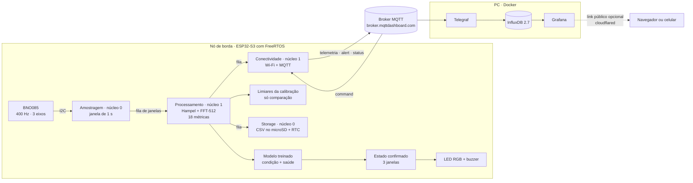
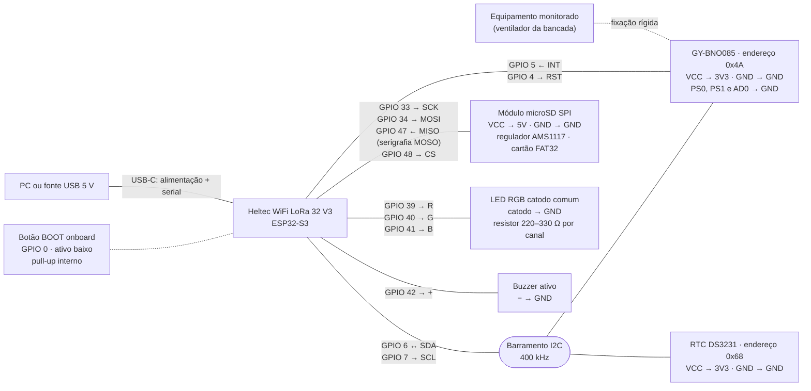
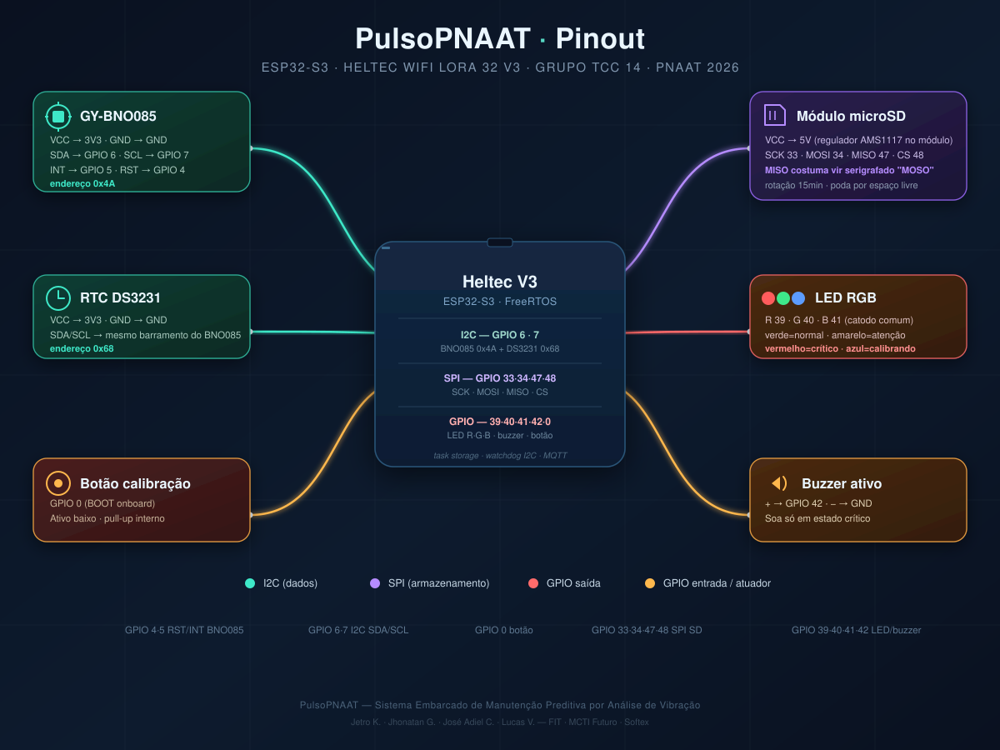
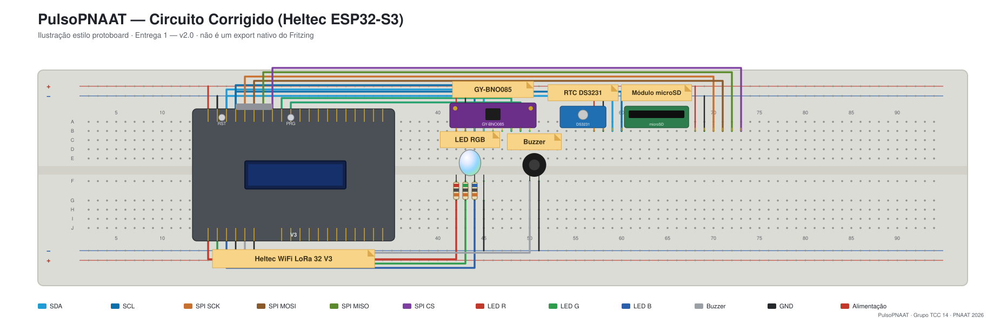

<p align="center">
  
</p>

# PulsoPNAAT: manutenção preditiva por análise de vibração

TCC da capacitação PNAAT 2026 (FIT · MCTI Futuro · Softex) · Grupo TCC 14

Equipe: Jetro Kepler Gomes Alencar Gonzaga Viana · Jhonatan Gonçalves Pereira ·
José Adiel Calixto Serafim · Lucas Vinicius Santos Leonel

Repositório: <https://github.com/jhonatan-goncalves-pereira/pulsopnaat>

---

## Sumário

1. [Visão geral](#1-visão-geral)
2. [Arquitetura](#2-arquitetura)
3. [Estrutura do repositório](#3-estrutura-do-repositório)
4. [Pré-requisitos](#4-pré-requisitos)
5. [Dependências e instalação](#5-dependências-e-instalação)
6. [Configuração](#6-configuração)
7. [Montagem elétrica](#7-montagem-elétrica)
8. [Como executar](#8-como-executar)
9. [Resultado esperado](#9-resultado-esperado)
10. [Modelo treinado e dataset](#10-modelo-treinado-e-dataset)
11. [Testes](#11-testes)
12. [Critérios de sucesso e resultados medidos](#12-critérios-de-sucesso-e-resultados-medidos)
13. [Limitações e pendências](#13-limitações-e-pendências)
14. [Solução de problemas](#14-solução-de-problemas)
15. [Convenções de contribuição](#15-convenções-de-contribuição)
16. [Links do projeto](#16-links-do-projeto)

---

## 1. Visão geral

Motores e rolamentos mudam o padrão de vibração semanas antes de quebrar, mas essa mudança não é
percebida a olho nu. Sem monitoramento, a manutenção só age depois da parada, com custo de
emergência e produção perdida (Cenário 8 do PNAAT: manufatura pesada, como as plantas de
transformação plástica do Cariri).

O PulsoPNAAT é um nó de borda (ESP32-S3 Heltec WiFi LoRa 32 V3 com acelerômetro GY-BNO085) preso na
carcaça do equipamento. Ele mede a vibração nos três eixos a 400 Hz e, a cada segundo, calcula 18
métricas (RMS, harmônicas 1x e 2x, banda 3x–5x, kurtosis e THD por eixo). Um modelo treinado com
dados reais do próprio equipamento reconhece em que condição ele está (parado, velocidade 1, 2 ou 3,
ou com falha de alimentação) e se a vibração é a esperada para essa condição. O resultado aparece no
LED RGB e no buzzer, vai por MQTT para um dashboard no Grafana e fica gravado em CSV no microSD, com
a hora do RTC DS3231.

Na bancada, o equipamento monitorado é um ventilador de 3 velocidades, e a falha é provocada
ligando-o num filtro de linha com mau contato.

**O que o sistema não faz (limites do escopo):**

- Não desliga o motor nem aciona atuadores: só observa e avisa.
- Não substitui laudo técnico. As métricas indicam tendências (1x sugere desbalanceamento, 2x
  desalinhamento etc.), não a causa exata.
- Não detecta falhas de rolamento de alta frequência (BPFO/BPFI, 1–10 kHz): amostrando a 400 Hz, a
  análise vai até 200 Hz (Nyquist).
- Não guarda histórico em nuvem: os dados ficam no cartão e no InfluxDB local.
- Não usa o rádio LoRa da placa: a rede é Wi-Fi + MQTT.

### Protótipo


---

## 2. Arquitetura

### 2.1 Fluxo Entrada → Processamento → Saída

**Entrada**

- Vibração: o GY-BNO085, preso na carcaça, entrega aceleração linear em m/s² (já sem a gravidade)
  a 400 Hz pelo I2C (GPIO 6/7), com aviso de dado pronto no GPIO 5.
- Comandos: botão BOOT da placa (GPIO 0), console serial ou mensagem no tópico
  `pulsopnaat/command`. Comandos aceitos: `calibrar`, `status` e os rótulos `parado`, `vel1`,
  `vel2`, `vel3`, `saudavel`, `falha` e `sem_rotulo`.
- Hora: com Wi-Fi, o nó sincroniza com `pool.ntp.org` e acerta o RTC DS3231, que guarda a hora sem
  rede.

**Processamento** (ESP32-S3 com FreeRTOS)

1. Amostragem (núcleo 0): janelas de 1 s com 400 amostras por eixo. Leituras impossíveis (acima de
   20 g) são descartadas, e o sensor é reiniciado sozinho se ficar 2 s sem mandar amostra.
2. Métricas (núcleo 1): filtro de Hampel e FFT de 512 pontos com janela de Hann, cerca de 11 ms
   por janela.
3. Condição e saúde: o modelo compara as 18 métricas com a assinatura de cada condição aprendida no
   treino (distância de Mahalanobis) e escolhe a mais próxima. Se a condição reconhecida for a falha
   de alimentação, o estado é crítico. Nas outras, a distância até a assinatura decide: normal,
   atenção ou crítico. A condição exibida só troca quando 7 das últimas 9 janelas concordam, e o
   estado só muda depois de 3 janelas seguidas iguais.
4. Máquina de estados: `BOOT → CALIBRANDO → MONITORANDO ⇄ CONTINGÊNCIA`. Os limiares estatísticos
   da calibração (média + 3σ e média + 6σ, com votação entre métricas) continuam sendo calculados e
   publicados, só para comparação com o modelo.

**Saída**

- Local: LED RGB (GPIO 39/40/41) e buzzer (GPIO 42).
- Remota: por MQTT, `pulsopnaat/telemetria` recebe uma mensagem por segundo (métricas, condição
  reconhecida, estado e a opinião dos limiares), `pulsopnaat/alert` recebe cada alerta confirmado e
  `pulsopnaat/status` recebe o status do nó. O Telegraf grava no InfluxDB, e o Grafana mostra o
  dashboard, localmente ou por um link público.
- Registro: CSV no microSD (`/sdcard/pulso/log_AAAAMMDD_HHMMSS.csv`), uma linha por segundo com hora
  UTC e um arquivo novo a cada 15 min. A gravação roda numa tarefa separada e não atrasa a amostragem.

### 2.2 Diagrama de arquitetura




### 2.3 Tarefas do firmware

As tarefas se comunicam só por filas: a rede e o cartão nunca bloqueiam a amostragem.

| Tarefa | Núcleo | Prioridade | Função | Onde está |
|---|---|---|---|---|
| `amostragem` | 0 | 10 | Lê o BNO085, monta a janela de 1 s e reinicia o sensor se ele parar | `components/vibration_sensor` |
| `processamento` | 1 | 5 | Hampel, FFT, métricas, calibração, modelo e decisão do estado | `main/main.c` |
| `alerta` | 1 | 3 | Máquina de estados, LED (atualizado a cada 100 ms) e buzzer | `components/alert_manager/alerta_servico.c` |
| `storage` | 0 | 3 | Grava o CSV, lê o RTC e remonta o cartão a cada 10 s se ele sair | `components/storage` |
| `conectividade` | 1 | 2 | Inicia o MQTT, publica telemetria, alertas e status, trata comandos | `main/main.c` |
| `comandos` | 0 | 2 | Botão BOOT e comandos pela serial | `main/main.c` |

### 2.4 Máquina de estados e sinalização

| Estado | Quando | LED | Buzzer |
|---|---|---|---|
| `BOOT` | Sem baseline calibrado | apagado | desligado |
| `CALIBRANDO` | 30 janelas após o comando `calibrar` | azul piscando rápido | desligado |
| `MONITORANDO` | Baseline pronto e Wi-Fi conectado | verde (saudável), amarelo piscando (atenção) ou vermelho fixo (crítico) | só em crítico |
| `CONTINGÊNCIA` | Wi-Fi indisponível; continua medindo e gravando | branco piscando | só em crítico |

Um reinício com baseline salvo na NVS volta direto para `MONITORANDO`.

---

## 3. Estrutura do repositório

```
.
├── main/                          app_main: filas, tarefas e ligação entre os componentes
│   ├── main.c  Kconfig.projbuild  idf_component.yml  CMakeLists.txt
├── components/                    cada componente tem include/, CMakeLists.txt e test/ quando testado
│   ├── i2c_config/                barramento I2C e dispositivo BNO085
│   ├── vibration_sensor/          aquisição a 400 Hz, janelas de 1 s e reinício do sensor
│   ├── signal_processing/         RMS, Hann, FFT-512, harmônicas, kurtosis, THD e Hampel
│   ├── baseline/                  calibração (30 janelas, Welford) e gravação na NVS
│   ├── alert_manager/             limiares 3σ/6σ, votação, máquina de estados, LED e buzzer
│   ├── regime_classifier/         modelo treinado: condição (parado, vel1–3, falha) e saúde
│   ├── anomaly_detector/          features log e detector Mahalanobis de uma classe
│   ├── wifi_config/               Wi-Fi station com reconexão automática
│   ├── mqtt_client/               cliente MQTT e JSON de alerta, status e telemetria
│   └── storage/                   CSV no microSD e RTC DS3231
├── test_app/                      app de testes Unity que roda na própria placa
├── tools/
│   ├── classificador/             treinar_regime.py, treinar_detector.py e relatórios gerados
│   └── stack/subir_stack_wsl.ps1  sobe a stack Docker no WSL2
├── dataset/ventilador/            dataset rotulado da bancada (CSVs, trechos e README)
├── grafana/provisioning/          datasource InfluxDB e dashboards do Grafana
├── docker-compose.yml             Mosquitto, InfluxDB, Telegraf, Grafana e túnel opcional
├── telegraf.conf  mosquitto/  .env.example
├── docs/img/                      cabeçalho, pinout, protoboard e animação da arquitetura
├── sdkconfig.defaults             configuração padrão do firmware (versionada)
├── dependencies.lock              versões travadas das bibliotecas do ESP-IDF
├── README_DOCKER.md               detalhes da stack Docker
├── Entregavel06Documentacao.md    documento da Entrega 6
└── README.md                      este manual
```

A parte de cálculo e decisão (`signal_processing`, `baseline`, `alert_manager`, `regime_classifier`,
`anomaly_detector`, `mqtt_payloads.c`) não depende de hardware, e por isso tem testes automatizados.
O acesso ao hardware (`i2c_config`, `vibration_sensor`, `wifi_config`, `pnaat_mqtt_client.c`,
`alerta_servico.c`, `storage`) fica nas bordas. Cada arquivo de código começa com um comentário que
explica sua função.

---

## 4. Pré-requisitos

### 4.1 Hardware

| Item | Uso | Observação |
|---|---|---|
| Heltec WiFi LoRa 32 V3 (ESP32-S3) | Processamento, Wi-Fi, LED e buzzer | Cabo USB-C de dados (cabo só de carga não grava) |
| Módulo GY-BNO085 | Acelerômetro de 3 eixos | Modo I2C: PS0 e PS1 no GND |
| RTC DS3231 | Hora dos registros | Mesmo barramento I2C do BNO085 |
| Módulo microSD SPI com regulador + cartão | Registro em CSV | Cartão em FAT32. Funcionou com 16 GB; um de 128 GB em exFAT não montou |
| LED RGB catodo comum + 3 resistores de 220–330 Ω | Sinalização | Anodo comum também serve, trocando a polaridade no `menuconfig` |
| Buzzer ativo | Alarme de estado crítico | Liga e desliga por nível lógico |
| Protoboard e jumpers curtos | Montagem | Fios do I2C curtos e longe do cabo de força do motor |
| Ventilador de 3 velocidades | Equipamento da bancada | Sensor preso firme na carcaça |
| Filtro de linha com mau contato | Falha de alimentação da demonstração | Opcional, só para reproduzir a falha |

### 4.2 Software

| Software | Versão usada | Uso |
|---|---|---|
| ESP-IDF | 5.5.5 (Windows, instalador EIM) | Compilar, gravar e monitorar o firmware |
| Driver CP210x (Silicon Labs) | — | A placa aparece como porta COM (ex.: `COM4`) ou `/dev/ttyUSB0` |
| Git | — | Clonar o repositório |
| Docker Engine + Compose v2 | Docker 29.1.3, Compose 2.40.3 | Stack MQTT → Telegraf → InfluxDB → Grafana |
| WSL2 + Ubuntu 22.04 | — | Só no Windows sem Docker Desktop |
| Python 3 + `numpy` | Python 3.11, numpy 2.4 | Treinar o modelo com o dataset |

### 4.3 Rede

Wi-Fi de **2,4 GHz** com internet. O ESP32-S3 não conecta em 5 GHz: num hotspot de celular, force a
banda de 2,4 GHz. O nó usa a internet para o broker MQTT público e o NTP; o PC, para baixar as
imagens Docker e publicar o link do Grafana.

---

## 5. Dependências e instalação

### 5.1 Dependências

| Dependência | Versão | De onde vem | Para quê |
|---|---|---|---|
| ESP-IDF | 5.5.5 | Instalador da Espressif | Toolchain, FreeRTOS, Wi-Fi, MQTT, NVS, FATFS, Unity |
| `rinku404/bno085` | 1.2.0 | `main/idf_component.yml` | Driver SH-2 do BNO085 |
| `espressif/esp-dsp` | ^1.6.0 (resolvido 1.8.2) | `components/signal_processing/idf_component.yml` | FFT e janela de Hann |
| `numpy` | 2.x | `pip` | Treino do modelo |
| `eclipse-mosquitto` | 2 | `docker-compose.yml` | Broker MQTT local (opcional) |
| `influxdb` | 2.7 | `docker-compose.yml` | Banco de séries temporais |
| `telegraf` | 1.30 | `docker-compose.yml` | Leva as mensagens MQTT para o InfluxDB |
| `grafana/grafana` | latest | `docker-compose.yml` | Dashboard |
| `cloudflare/cloudflared` | latest | `docker-compose.yml` (perfil `online`) | Link público do Grafana |

As bibliotecas do firmware são baixadas no primeiro `idf.py build`, com as versões travadas em
`dependencies.lock`.

### 5.2 Repositório

```bash
git clone https://github.com/jhonatan-goncalves-pereira/pulsopnaat.git
cd pulsopnaat
```

### 5.3 ESP-IDF 5.5.5

Instale pelo guia oficial do ESP32-S3:
<https://docs.espressif.com/projects/esp-idf/en/stable/esp32s3/get-started/>. Em cada terminal novo,
ative o ambiente:

```powershell
# Windows (caminho padrão do instalador EIM)
. 'C:\Espressif\tools\Microsoft.v5.5.5.PowerShell_profile.ps1'
```

```bash
# Linux/macOS (depende de onde o ESP-IDF foi instalado)
. $HOME/esp/esp-idf/export.sh
```

Num clone novo, escolha o alvo uma vez. Cuidado: `set-target` recria o `sdkconfig` e apaga o Wi-Fi e
o broker que já estavam configurados.

```bash
idf.py set-target esp32s3
```

### 5.4 Docker

No Linux, no macOS ou no Windows com Docker Desktop, basta instalar o Docker. No Windows sem Docker
Desktop (por exemplo, com erro 14098 ao ativar o Hyper-V), rode uma vez no PowerShell:

```powershell
wsl --install -d Ubuntu --web-download --no-launch
& "$env:LOCALAPPDATA\Microsoft\WindowsApps\ubuntu.exe" install --root
wsl -d Ubuntu -u root -- apt-get update
wsl -d Ubuntu -u root -- apt-get install -y docker.io docker-compose-v2
```

### 5.5 Python

```bash
python -m pip install numpy
```

---

## 6. Configuração

### 6.1 Firmware (`idf.py menuconfig`)

| Menu | Opção | Valor na bancada | Precisa mudar? |
|---|---|---|---|
| `Component config → WiFi Configuration` | WiFi SSID / WiFi Password | Rede de 2,4 GHz | Sim. Com SSID vazio a placa reinicia em loop, porque o `app_main` aborta quando o Wi-Fi não inicia |
| `Component config → MQTT Client Configuration` | MQTT Broker URI | `mqtt://broker.mqttdashboard.com:1883` | Sim. O padrão `mqtt://localhost:1883` não funciona no ESP32 |
| `PulsoPNAAT → Equipamento monitorado` | RPM nominal | 1500 | Só em outro equipamento: define onde a FFT procura as harmônicas |
| `PulsoPNAAT → Conectividade (MQTT)` | Node ID | `pulsopnaat-01` | Não |
| `PulsoPNAAT → I2C & GPIO (BNO085)` | SDA, SCL, INT, RST, endereço | 6, 7, 5, 4, 0x4A | Só se a fiação for outra |
| `Component config → PulsoPNAAT: sinalização local…` | GPIOs, polaridade do LED/buzzer, janelas de confirmação | 39/40/41, 42, catodo comum, 3 | Só se a fiação for outra |
| `Component config → PulsoPNAAT: Armazenamento…` | GPIOs do SPI, rotação do log, endereço do RTC | 33/34/47/48, 15 min, 0x68 | Só se a fiação for outra |

Essas escolhas ficam no `sdkconfig`, que não vai para o Git. Os padrões versionados estão em
`sdkconfig.defaults` (incluindo a partição grande para o firmware, que passa de 1 MB).

### 6.2 Stack de observabilidade (`.env`)

```bash
cp .env.example .env        # Windows: Copy-Item .env.example .env
```

Nenhum valor do `.env` vem de um serviço externo. O InfluxDB e o Grafana rodam nos contêineres da
própria stack e são criados com o que estiver nesse arquivo na primeira vez que sobem. O `.env` não
vai para o Git.

| Variável | O que é | Como preencher |
|---|---|---|
| `INFLUXDB_USERNAME` / `INFLUXDB_PASSWORD` | Admin do InfluxDB (`http://localhost:8086`) | Escolha; a senha precisa de pelo menos 8 caracteres |
| `INFLUXDB_ORG` / `INFLUXDB_BUCKET` | Organização e bucket usados pelo Telegraf e pelo Grafana | Organização livre (padrão `myorg`); o bucket precisa ser `mqtt_data`, que é o nome usado nas consultas do dashboard |
| `INFLUXDB_TOKEN` | Token do Telegraf e do Grafana | Uma sequência aleatória: `openssl rand -hex 32` ou, no PowerShell, `[guid]::NewGuid().ToString('N') + [guid]::NewGuid().ToString('N')` |
| `GRAFANA_ADMIN_USER` / `GRAFANA_ADMIN_PASSWORD` | Login de administrador do Grafana | Escolha; use senha forte se for publicar o link |
| `GRAFANA_ANONYMOUS_ENABLED` | `true` deixa ver o dashboard sem login, só leitura | `true` na apresentação |
| `GRAFANA_PORT` | Porta do Grafana no PC | `3000`, ou `3001` se a 3000 estiver ocupada |
| `MQTT_BROKER` | Broker que o Telegraf assina | O mesmo do firmware, com `tcp://`: `tcp://broker.mqttdashboard.com:1883` |

Os valores `INFLUXDB_*` e `GRAFANA_ADMIN_*` só são lidos quando os volumes são criados. Para trocar a
senha do Grafana depois, use `docker exec grafana grafana cli admin reset-admin-password <nova-senha>`.
Para trocar os do InfluxDB, rode `docker compose down -v` (apaga os dados) e suba de novo. Mais
detalhes da stack em [README_DOCKER.md](README_DOCKER.md).

### 6.3 Calibração do baseline (RF08)

Sem baseline o nó fica em `BOOT` e não publica telemetria. A calibração nunca é automática:

1. Deixe o equipamento funcionando normalmente, já estabilizado.
2. Aperte o botão BOOT da placa, digite `calibrar` no monitor serial ou publique `calibrar` em
   `pulsopnaat/command` (por exemplo no
   [HiveMQ WebSocket Client](https://www.hivemq.com/demos/websocket-client/), conectado a
   `broker.mqttdashboard.com`).
3. Não encoste no equipamento por uns 30 s. O LED fica azul piscando.
4. O serial mostra `baseline calibrado (30 janelas) e salvo na NVS`.

O baseline fica gravado na NVS e sobrevive a reinícios. A calibração também funciona sem Wi-Fi. Com o
modelo treinado embarcado, quem decide o LED é o modelo, e os limiares da calibração ficam só como
comparação.

### 6.4 Tópicos MQTT

| Tópico | Direção | Conteúdo |
|---|---|---|
| `pulsopnaat/telemetria` | nó → broker | Uma vez por segundo: máquina de estados, estado (`nivel` 0/1/2), as 18 métricas, `regime` (0 parado, 1–3 velocidade, 4 falha), `dist_regime`, `nivel_limiares` e `rotulo` |
| `pulsopnaat/alert` | nó → broker | Quando o estado confirmado muda para atenção ou crítico: `node`, `ts_us`, `estado`, `rms_x/y/z` |
| `pulsopnaat/status` | nó → broker | Ao conectar e sob o comando `status`: máquina, estado, baseline e uptime |
| `pulsopnaat/command` | broker → nó | `calibrar`, `status` ou um rótulo (`parado`, `vel1`, `vel2`, `vel3`, `saudavel`, `falha`, `sem_rotulo`) |

O broker público `broker.mqttdashboard.com` é compartilhado e pode oscilar. Para uma instalação sem
depender da internet, use o Mosquitto da stack (`tcp://mosquitto:1883` no `.env` e o IP do PC no
firmware).

---

## 7. Montagem elétrica

### 7.1 Esquema

Todos os módulos usam o GND da placa. O BNO085 e o DS3231 dividem o mesmo barramento I2C.



Pinagem tirada de `main/Kconfig.projbuild`, `components/alert_manager/Kconfig` e
`components/storage/Kconfig`.

| Heltec V3 | GY-BNO085 | DS3231 | microSD | LED RGB | Buzzer |
|---|---|---|---|---|---|
| 3V3 | VCC | VCC | — | — | — |
| 5V | — | — | VCC | — | — |
| GND | GND, PS0, PS1, AD0 | GND | GND | catodo | − |
| GPIO 6 | SDA | SDA | — | — | — |
| GPIO 7 | SCL | SCL | — | — | — |
| GPIO 5 | INT | — | — | — | — |
| GPIO 4 | RST | — | — | — | — |
| GPIO 33 | — | — | SCK | — | — |
| GPIO 34 | — | — | MOSI | — | — |
| GPIO 47 | — | — | MISO ("MOSO") | — | — |
| GPIO 48 | — | — | CS | — | — |
| GPIO 39 / 40 / 41 | — | — | — | R / G / B (com resistor) | — |
| GPIO 42 | — | — | — | — | + |

Pinagem resumida:



Ilustração da protoboard ([PulsoPNAAT_protoboard.svg](docs/img/PulsoPNAAT_protoboard.svg)):




### 7.2 Passo a passo

Com a placa desligada do USB:

1. Ligue o GND da Heltec na linha negativa da protoboard; todos os módulos usam esse GND.
2. GY-BNO085: VCC no 3V3, GND no GND, SDA no GPIO 6, SCL no GPIO 7, INT no GPIO 5 e RST no GPIO 4.
   PS0 e PS1 vão no GND (modo I2C; soltos, o sensor não responde) e AD0 também no GND (endereço
   0x4A). O endereço 0x28 é do BNO055 e não responde neste módulo.
3. RTC DS3231: VCC no 3V3, GND no GND, SDA no GPIO 6 e SCL no GPIO 7, em paralelo com o BNO085.
4. Módulo microSD: VCC no **5V**, porque o regulador do módulo não funciona com 3V3 (o cartão recebe
   uns 2,2 V e falha com erro `0x107`). GND no GND, SCK no GPIO 33, MOSI no GPIO 34, MISO no GPIO 47
   e CS no GPIO 48. O MISO costuma vir escrito "MOSO"; trocá-lo com o MOSI é o erro mais comum.
5. LED RGB (catodo comum): R, G e B nos GPIOs 39, 40 e 41, cada um com seu resistor; o catodo (perna
   mais longa) no GND.
6. Buzzer ativo: positivo no GPIO 42 e negativo no GND.
7. Botão de calibração: é o BOOT da própria placa (GPIO 0), não precisa de fio.
8. Prenda o BNO085 firme na carcaça do equipamento (parafuso, abraçadeira ou cola rígida). Sensor
   solto ou jumper com mau contato derrubam as leituras. Se precisar remapear pinos na Heltec V3,
   evite os GPIOs 8 a 14 (rádio LoRa) e 17, 18 e 21 (OLED).
9. Formate o cartão em FAT32, encaixe no módulo e só então ligue o USB.

---

## 8. Como executar

### 8.1 Compilar e gravar o firmware

Com o ESP-IDF ativo, na raiz do repositório:

```bash
idf.py build
idf.py -p COM4 flash monitor     # Linux: -p /dev/ttyUSB0 (sair do monitor: Ctrl+])
```

Se a porta sumir, troque o cabo ou a porta USB (hub e USB de monitor costumam dar problema). Feche o
monitor antes de gravar de novo: com ele aberto, a porta fica ocupada.

### 8.2 Subir a stack

No Windows com WSL2, na raiz do repositório:

```powershell
powershell -ExecutionPolicy Bypass -File tools\stack\subir_stack_wsl.ps1 -Online
```

O script liga o Docker dentro do WSL, cria o `.env` se ele não existir e sobe os contêineres. Com
`-Online` ele também sobe o serviço `tunel` (cloudflared), que publica o Grafana num endereço HTTPS
sem precisar de conta nem de porta aberta no roteador. No fim aparecem os dois endereços:

```
Grafana: http://localhost:3001/d/pulsopnaat-monitor  (usuario/senha do .env, padrao admin/admin)
Online:  https://<aleatorio>.trycloudflare.com/d/pulsopnaat-monitor?kiosk&refresh=5s
```

No Linux, no macOS ou com Docker Desktop:

```bash
docker compose --profile online up -d        # sem link público: docker compose up -d
docker compose logs tunel | grep trycloudflare
```

O endereço `trycloudflare.com` muda sempre que o contêiner `tunel` reinicia.

### 8.3 Operar

1. Com o firmware e a stack no ar, calibre (§6.3) se a placa ainda não tiver baseline.
2. Abra o dashboard "PulsoPNAAT — Monitoramento em tempo real", com período de 15 minutos. Para
   apresentar, use o endereço com `?kiosk`.
3. `status`, na serial ou no MQTT, mostra máquina de estados, baseline, condição reconhecida e
   distância.
4. Para gravar dados novos, informe a condição com `parado`, `vel1`, `vel2`, `vel3` ou `falha`. O
   rótulo vai para o CSV e aparece no dashboard; volte a `sem_rotulo` ao terminar. Ele fica só na
   memória, então precisa ser enviado de novo depois de um reinício da placa.

### 8.4 Treinar o modelo de novo

Use depois de coletar dados novos, ou quando o equipamento mudar de lugar ou de montagem (§10.4):

```bash
python tools/classificador/treinar_regime.py dataset/ventilador/serial_2026-09-16.csv \
  dataset/ventilador/influx_2026-09-16_posicao2.csv \
  --segmentos dataset/ventilador/segmentos.csv \
  --eventos dataset/ventilador/eventos_limiares_2026-09-16.txt --margem-s 8
idf.py -p COM4 flash
```

O script gera `components/regime_classifier/modelo_regime.h` e o relatório
`tools/classificador/relatorio_regime.md`.

### 8.5 Testes na placa

```bash
idf.py -C test_app set-target esp32s3     # só na primeira vez
idf.py -C test_app -p COM4 flash monitor
```

O app de teste substitui o firmware na placa, então grave o firmware principal de novo depois (§8.1).

### 8.6 Desligar a stack

```powershell
# Windows com WSL2 (os dados ficam nos volumes)
wsl -d Ubuntu -u root --cd /mnt/c/<caminho/do/repo> -- docker compose --profile online down
```

```bash
# Linux, macOS ou Docker Desktop
docker compose --profile online down
```

---

## 9. Resultado esperado

### 9.1 Monitor serial no boot

| Trecho da mensagem | O que confirma |
|---|---|
| `I2C pronta: SDA=6 SCL=7 freq=400000 Hz endereço BNO085=0x4A` | I2C configurado |
| `janela #N: 400 amostras, … taxa efetiva=` perto de 400 Hz, sem `[FORA DA FAIXA ~400 Hz]` | Sensor a 400 Hz |
| Uma linha com 18 números por segundo | Métricas sendo calculadas |
| `microSD montado em /sdcard (SCK=33 MOSI=34 MISO=47 CS=48)` | Cartão funcionando |
| `modelo de regime embarcado (5 regimes), decide LED e alertas` | Modelo treinado ativo |
| `regime reconhecido: -1 → 0` (ou a velocidade atual) | Condição reconhecida |
| `Got IP: …` e depois `MQTT conectado e inscrito nos tópicos. Sistema online.` | Rede e broker |
| `RTC ajustado via SNTP: AAAA-MM-DDTHH:MM:SSZ` | Hora certa |
| `baseline válido carregado da NVS` | Calibração carregada |

`sem modelo de anomalia embarcado` é esperado: esse é o detector antigo de uma classe só, substituído
pelo modelo de condição.

### 9.2 LED e buzzer

| Situação | LED | Buzzer |
|---|---|---|
| Sem baseline (`BOOT`) | apagado | desligado |
| Calibrando | azul piscando rápido | desligado |
| Parado ou em qualquer velocidade, vibração normal para ela | verde fixo | desligado |
| Vibração fora do normal para a velocidade reconhecida | amarelo piscando | desligado |
| Falha de alimentação reconhecida, ou vibração muito fora do normal | vermelho fixo | ligado |
| Sem Wi-Fi (`CONTINGÊNCIA`) | branco piscando | só se o estado for crítico |

Teste da bancada: troque entre as velocidades 0, 1, 2 e 3 esperando uns 30 s em cada, e o LED
continua verde. Passe o ventilador para o filtro de linha com mau contato: em 1 a 3 s o LED fica
vermelho e o buzzer toca. Volte para a tomada boa e ele retorna ao verde.

### 9.3 Dashboard

A telemetria só começa depois da calibração. Com o nó monitorando:

| Painel | O que deve aparecer |
|---|---|
| Velocidade atual (reconhecida pelo modelo) | `PARADO`, `VELOCIDADE 1`, `2` ou `3`, ou `FALHA DE ALIMENTAÇÃO`, acompanhando o ventilador com alguns segundos de atraso |
| Saúde do equipamento (LED e alertas) | `SAUDÁVEL` nas velocidades normais; `CRÍTICO` na falha |
| Máquina de estados | `MONITORANDO` |
| Limiares antigos (calibração única) | O que os limiares da calibração diriam. Costuma marcar `CRÍTICO` fora da velocidade calibrada e `SAUDÁVEL` na falha, o que mostra a diferença para o modelo |
| Velocidade reconhecida (e rótulo, quando houver) | Faixa colorida com a condição ao longo do tempo; a linha do rótulo só aparece quando alguém informa um |
| Saúde: modelo × limiares antigos | As duas opiniões lado a lado ao longo do tempo (RF11) |
| RMS por eixo | Energia da vibração: ~0,02 m/s² parado, ~0,05 a 0,1 na falha e ~0,15 a 0,45 ligado |
| Distância à assinatura da velocidade atual | Sobe quando a vibração foge do normal da condição |
| Harmônica 1x e kurtosis por eixo | Curvas por eixo |
| Alertas confirmados | Uma linha a cada vez que o estado muda para atenção ou crítico |

Os dados chegam em lotes de até 10 s (intervalo do Telegraf), e o dashboard atualiza a cada 5 s. Pelo
link público os painéis abrem sem login quando `GRAFANA_ANONYMOUS_ENABLED=true`.

### 9.4 MQTT e cartão SD

- No [HiveMQ WebSocket Client](https://www.hivemq.com/demos/websocket-client/), conectado a
  `broker.mqttdashboard.com` e assinando `pulsopnaat/#`, chega uma mensagem por segundo em
  `pulsopnaat/telemetria` e uma em `pulsopnaat/alert` a cada alerta.
- No cartão, a pasta `pulso/` tem os arquivos `log_AAAAMMDD_HHMMSS.csv`, com cabeçalho
  `timestamp,node_id,estado_maquina,estado_equipamento,rms_x,…,thd_z,rotulo,score_anomalia,anomalia,regime,distancia_regime,estado_limiares`
  e uma linha por segundo em UTC (horário de Brasília = UTC−3).

### 9.5 Testes

O serial do app de teste termina com `102 Tests 0 Failures 0 Ignored` e `OK`.

---

## 10. Modelo treinado e dataset

### 10.1 Por que um modelo

Na prova de conceito, quem decidia era a calibração: 30 s com a máquina saudável, média e
desvio-padrão (σ) de cada métrica, limite de atenção em média + 3σ e de crítico em média + 6σ, com
votação entre as métricas. Na bancada, isso mostrou dois problemas. Calibrado numa velocidade,
qualquer outra velocidade saudável parece anormal. E na falha de alimentação a vibração cai, o que um
limite para cima não enxerga. A seção 5.4 do documento de requisitos já previa a evolução para um
modelo treinado offline com inferência embarcada.

### 10.2 Como funciona

- Cada condição (parado, velocidade 1, 2, 3 e falha de alimentação) vira uma "assinatura": a média
  das 18 métricas, em escala logarítmica, e o jeito como elas variam juntas (covariância com
  encolhimento de Ledoit-Wolf).
- A janela vai para a condição de menor distância de Mahalanobis (com o termo log|Σ|).
- A saúde vem da distância até a condição reconhecida. O limite de atenção é o quantil 0,999 das
  distâncias vistas no treino daquela condição, e o de crítico é 1,5 vez esse valor. Reconhecer a
  falha já é crítico.
- O treino roda no PC (`tools/classificador/treinar_regime.py`), e o ESP32 só faz a conta: cerca de
  1,3 mil multiplicações por janela, com o modelo ocupando poucos kilobytes.

### 10.3 Dataset e resultados

O dataset está em [dataset/ventilador/](dataset/ventilador/README.md): 4.187 janelas, 3.688
rotuladas, com o ventilador em duas posições. O teste usa passagens que ficaram fora do treino: o
ventilador saiu da condição e voltou depois, e pelo menos uma passagem de falha em cada posição ficou
só no teste.

| | Modelo treinado | Limiares da calibração |
|---|---|---|
| Acurácia da saúde | 99,1% | 21,3% |
| Falso alarme em operação normal | 0,7% | 92,0% |
| Falhas detectadas | 98,2% | 73,1% |
| Condição reconhecida (parado, vel1, vel2, vel3, falha) | 90,0% | — |

Parado, velocidade 3 e as falhas acertaram 100%. As velocidades 1 e 2 ficaram em 81% e 78%, às vezes
confundidas com a velocidade seguinte. O relatório completo está em
[tools/classificador/relatorio_regime.md](tools/classificador/relatorio_regime.md).

**Portão de decisão (seção 5.4 dos requisitos):** o script só marca o modelo para comandar LED,
buzzer e alertas se ele atingir as metas (acurácia de pelo menos 85% e pelo menos 80% das falhas
detectadas) e for melhor que os limiares. Se não atingir, o modelo fica em modo sombra e só aparece
no dashboard.

### 10.4 Quando treinar de novo

O modelo vale para o equipamento e a montagem em que foi treinado. Na bancada, mudar o ventilador de
lugar derrubou a vibração no eixo Z pela metade, e o modelo passou a confundir velocidades e a ver a
falha como parado. A correção foi gravar uns 20 min na posição nova (duas passagens por condição),
acrescentar os trechos em `dataset/ventilador/segmentos.csv` e treinar com as duas posições (§8.4).

---

## 11. Testes

Os testes usam o Unity do ESP-IDF e rodam na própria placa, para validar o cálculo em ponto
flutuante e o esp-dsp no Xtensa (§8.5). Resultado atual: 102 testes, 0 falhas.

| Suíte | Arquivo | O que cobre |
|---|---|---|
| `signal_processing` | `components/signal_processing/test/test_signal_processing.c` | RMS, cadeia espectral (senoide em f0/2f0/4f0), THD, kurtosis, Hampel |
| `baseline` | `components/baseline/test/test_baseline.c` | Welford, coleta parcial, validação, gravação NVS (mágica, versão, CRC) |
| `alert_manager` | `components/alert_manager/test/test_alert_manager.c` | Limiares 3σ/6σ, votação, pior eixo, confirmação, máquina de estados |
| `mqtt_client` | `components/mqtt_client/test/test_mqtt_client.c` e `test_mqtt_telemetria.c` | JSON de alerta, status e telemetria, truncamento e valores inválidos |
| `anomaly_detector` | `components/anomaly_detector/test/test_anomaly_detector.c` | Features log, Mahalanobis, limiar e modelo embarcado |
| `regime_classifier` | `components/regime_classifier/test/test_regime_classifier.c` | Condição mais próxima, desempate pelo determinante da covariância, atenção e crítico, falha conhecida, filtro 7 de 9, modelo embarcado |

A integração com hardware (I2C a 400 Hz, Wi-Fi e MQTT, LED e buzzer, cartão) foi validada na bancada,
pelo serial, pelo CSV e pelo dashboard.

---

## 12. Critérios de sucesso e resultados medidos

| Critério (documento de requisitos, §6) | Meta | Resultado |
|---|---|---|
| Acurácia de detecção | ≥ 85% | 99,1% na saúde, em passagens fora do treino. A falha usada foi a de alimentação, não o peso de desbalanceamento previsto |
| Taxa de falso positivo | ≤ 2 alertas falsos por hora | 0,7% das janelas saudáveis de teste. Alertas por hora numa hora contínua: não medido |
| Latência de processamento | Janela processada em menos de 1 s | ~11 ms por janela |
| Resiliência de rede | Reconectar e reenviar alertas em até 10 s | Reconexão automática (5 tentativas seguidas e depois a cada 30 s). Reenvio de alertas: pendente (§13). Tempo: não medido |
| Estabilidade | ≥ 2 h sem travar | Não medido formalmente em 2 h contínuas |
| Integridade do registro | ≥ 99% das janelas no log | Gravação com `fsync` a cada linha. Não medido formalmente |
| Detecção de parada | Transição registrada em até 3 janelas | Parado reconhecido em 100% das janelas de teste. A condição exibida troca após 7 de 9 janelas |

---

## 13. Limitações e pendências

Itens do documento de requisitos que ficaram parciais ou fora desta versão:

- **RF05:** o alerta MQTT traz estado e RMS por eixo, mas não indica o eixo de maior desvio. A
  telemetria por segundo traz as 18 métricas.
- **RF07:** não há buffer de alertas. Alertas gerados sem conexão MQTT não são reenviados depois,
  mas ficam registrados no cartão.
- **RF10:** o dashboard não tem botões de ação. A calibração remota é feita publicando `calibrar` em
  `pulsopnaat/command`.
- **RF13:** a parada é reconhecida pelo modelo (condição `parado`, gravada por janela no CSV), não por
  um piso de RMS.
- **RF14:** não há captura do sinal bruto por gatilho.
- **RNF06:** o watchdog de interrupção reinicia a placa se o processador travar. O watchdog de
  tarefas só avisa; para reiniciar também, ative `CONFIG_ESP_TASK_WDT_PANIC`.
- **RNF08:** a proteção IP54 do invólucro não foi avaliada.
- O modelo vale para o ventilador e as montagens do dataset; outro equipamento precisa de dataset
  próprio. A falha treinada é só a de alimentação.
- O RPM nominal (1500) é o padrão do projeto; a rotação real do ventilador não foi medida.
- O broker público pode oscilar; para uso contínuo, prefira o Mosquitto local.

---

## 14. Solução de problemas

| Sintoma | Causa provável | O que fazer |
|---|---|---|
| Sensor não responde / NACK em `0x28` | Endereço errado: 0x28 é do BNO055 | Use 0x4A (AD0 no GND) |
| Nada em 0x4A | PS0/PS1 soltos, VCC/GND ou SDA/SCL trocados | PS0 e PS1 no GND; confira §7 |
| Placa reinicia em loop logo no boot | SSID vazio no `menuconfig` | Preencha o Wi-Fi (§6.1) |
| LED branco piscando o tempo todo | Wi-Fi em 5 GHz, nome ou senha errados | Use rede de 2,4 GHz com o mesmo nome e senha gravados no firmware |
| Conecta ao Wi-Fi, mas nada chega ao dashboard | Broker errado no firmware ou no `.env`, ou stack desligada | Confira `MQTT Broker URI` e `MQTT_BROKER`; suba a stack (§8.2) |
| Nó parado em `BOOT` | Sem baseline | Calibre (§6.3) |
| microSD não monta (`0x107`) | MISO e MOSO trocados, cartão exFAT ou módulo em 3V3 | Confira §7.2, formate em FAT32, alimente em 5V |
| `app partition is too small` | `sdkconfig` antigo com partição de 1 MB | No `menuconfig`, escolha "Partition Table → Single factory app (large)", ou apague o `sdkconfig` e configure o Wi-Fi de novo |
| Gravação falha com "No serial data received" ou "Failed to read target memory" | Mau contato no cabo ou porta USB | Desconecte o USB por alguns segundos e ligue direto no PC |
| "Acesso negado" na COM4 | Monitor serial aberto | Feche o monitor com Ctrl+] |
| Condição errada depois de mexer no equipamento | A montagem mudou a vibração | Colete a posição nova e treine de novo (§10.4) |
| Dashboard antigo na tela | A aba não recarregou | Ctrl + Shift + R |
| Tabela de alertas vazia | O alerta só aparece na troca de estado e saiu do período escolhido | Use "Last 15 minutes" ou mais |
| WSL com "Input/output error" em `/mnt/c` | Rede do Windows mudou | `wsl --shutdown` e rode `subir_stack_wsl.ps1` de novo |
| MQTT conecta e cai | Broker público sobrecarregado | Aguarde a reconexão ou use o Mosquitto local |

---

## 15. Convenções de contribuição

- Branches: `main` sempre estável; trabalho em `feature/<escopo>`, `feat/<escopo>`, `fix/<escopo>` ou
  `docs/<escopo>`, integrado por pull request.
- Commits no formato `<tipo>: <descrição no imperativo>`, com os tipos `feat`, `fix`, `docs`, `test`,
  `refactor`, `perf` e `chore`.

---

## 16. Links do projeto

| Artefato | Link |
|---|---|
| Repositório | <https://github.com/jhonatan-goncalves-pereira/pulsopnaat> |
| Documento de Requisitos (Google Docs) | <https://docs.google.com/document/d/1QIgbHTcKwcer_rzORCKN2OAKju7ix4JR/edit?usp=sharing> |
| Planilha de controle (`tcc-pulso-tracker.xlsx`) | <https://docs.google.com/spreadsheets/d/1MkHiGMCMCF25L5tZ5RpFTZwveaDipnlx/edit?usp=sharing> |
| Pasta de entregáveis (Google Drive) | <https://drive.google.com/drive/folders/1q1L6O3FajovOKOLExfUZOBMS1porxC6X?usp=sharing> |
| Cliente MQTT no navegador (HiveMQ) | <https://www.hivemq.com/demos/websocket-client/> |
